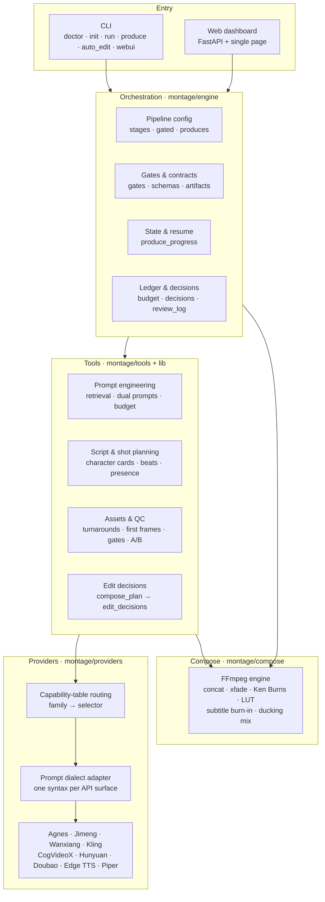
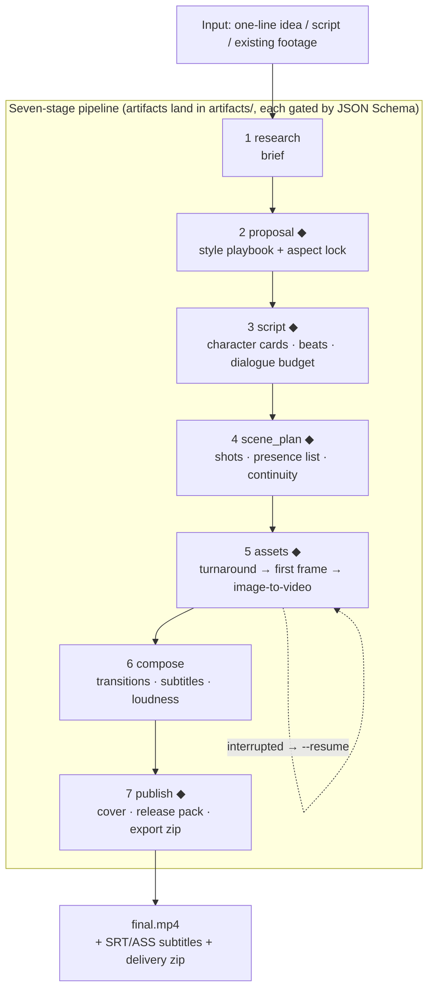

[中文](README.md) | [English](README.en.md)

# montage-core

**A Chinese-first, agent-driven AI video production system**

Turns "AI video production" into a governable, extensible pipeline with real shot language:
give it an idea or a script and it produces a finished film with shot language, subtitles and
loudness levelling across seven stages. Every stage emits a schema-validated JSON contract,
so the pipeline can always be paused, reviewed and resumed.


> The film above was produced end-to-end by this pipeline: 5 acts / 36 shots / 367 s,
> 1920×1080@30, burned-in subtitles and per-shot loudness levelling. Three frames from it
> (originals in [`docs/images/`](docs/images/)):

| Act 1 · Rain at the temple gate | Act 2 · Listening to the guqin | Act 4 · The truth |
|---|---|---|
|  |  |  |

## At a Glance

| Dimension | Scale |
|-----------|-------|
| Pipelines | 3 (cinematic / documentary / clip_factory) × 7 stages |
| Tools | 60 registered tools across 19 capability families |
| Providers | 10+ adapters: Agnes / Jimeng (Ark) / Wanxiang / Kling / Zhipu CogVideoX / Hunyuan / Doubao / Edge TTS / Piper |
| Styles | 9 original playbooks (zero-dependency Python dicts, no YAML) |
| Knowledge assets | 170 structured Chinese prompt entries + 6 original `.cube` LUTs + SFX/music indexes |
| Engineering | ~75k lines of Python · 1712 tests · single runtime dependency (`jsonschema`) |

## Architecture



## Production Flow



◆ = gate / human-confirmation checkpoint (`await_*`). Checkpoint state lives in
`artifacts/produce_progress.json`, so both the agent and a human read the same source of truth.

## Engineering Highlights

1. **Contract governance instead of script spaghetti**: every stage emits a JSON-Schema-validated
   artifact; `engine/gates.py` verifies "declared produces exist + schema is valid" when a
   checkpoint completes and blocks otherwise, with an explicit `MONTAGE_RELAX_GATES=1` downgrade;
   artifacts are written atomically and budgets are reconciled through an append-only settlement log.
2. **Capability-table routing across providers**: no `if provider == ...` branching — a capability
   table declares what each API surface supports and a selector routes by capability family. Each
   API surface carries its own prompt-dialect profile (character limit, citation syntax, audio
   syntax, forbidden tokens), so an invalid prompt is never sent in the first place.
3. **Resumable runs and controlled cost**: `produce_progress.json` records the checkpoint and the
   next command, so any interruption resumes with `--resume`; generation is previewed with a
   `dry_run` cost estimate and never calls the API over budget; `--retry` re-runs only the named
   shots after confirmation; the generation cache is keyed by prompt + reference-image fingerprint.
4. **Deterministic defences for invisible problems**: per-clip normalisation before concatenation
   (scale/pad/fps/48kHz), frame-quantised xfade offsets, EBU R128 loudness levelling, and a
   `film_health` report that catches PTS gaps, frozen frames and inter-segment loudness spread —
   the class of bug that shows up as "the player freezes here".
5. **Prompt engineering as a knowledge asset**: 170 structured Chinese entries plus public-domain
   screenplay templates and a five-layer shot-language model; each shot gets a dual prompt
   (first-frame image + video motion) with a hard compression budget that never drops action or dialogue.

## Quick Start

```bash
cd montage-core
pip install -e .                  # core dependency: jsonschema only
cp .env.example .env              # Windows PowerShell: Copy-Item .env.example .env

# Two demos that need no API keys (local deterministic tools)
python examples/pipeline_flow.py
python examples/zero_key_edit.py  # needs MONTAGE_REAL_FFMPEG=1

python -m montage doctor          # see which providers become available
python -m montage init <id> --title "Project Name"
python -m montage produce <project_dir>                     # soundtrack → assemble → finish → release pack → zip
python -m montage produce <project_dir> --retry sh01 --yes   # re-run named shots (cost previewed)
python -m montage auto_edit <dir> --video raw.mp4 --style documentary
python -m montage webui --port 8399                         # needs pip install "montage-core[webui]"
python -m pytest -q               # 1712 tests
```

Requires `ffmpeg` / `ffprobe`. Keys live only in the repo-root `.env` (already git-ignored).

## Repository Layout

```
montage-core/
├── montage/
│   ├── toolbase.py          # BaseTool contract (ToolResult / status / cost estimate / input validation)
│   ├── registry.py          # tool registry + capability selection + capability menu
│   ├── schemas.py           # canonical artifact JSON Schemas (script carries character cards/beats)
│   ├── pipelines.py         # cinematic / documentary / clip_factory pipeline configs
│   ├── cli.py               # doctor/tools/init/status/check/run/produce/auto_edit/webui
│   ├── engine/              # stages / artifacts / budget / decisions / gates / produce
│   ├── tools/               # vocabulary retrieval / visual prompts / edit advisor / script validation / QC
│   ├── providers/           # capability table + dialect adapter + per-vendor adapters
│   ├── playbooks/           # 9 original style playbooks (Python dicts, no YAML)
│   ├── compose/             # FFmpeg engine + audio levelling + LUT grading + output profiles
│   └── webui/               # FastAPI service + single-page dashboard
├── lib/                     # deterministic knowledge modules (prompt assembly, presence, asset index)
├── prompt_library/          # 170 structured Chinese entries (see CREDITS.md)
├── assets/                  # open media asset library (SFX/music/LUT/font indexes + licences)
├── docs/                    # AGENT_GUIDE / DIRECTOR_GUIDE / REVIEWER / ROLES / ROADMAP
├── examples/                # pipeline_flow / zero_key_edit
├── scripts/                 # minitest / make_luts
└── tests/                   # 1712 tests
```

## Design Trade-offs

- **Exactly one runtime dependency (`jsonschema`)**: provider HTTP uses the standard-library
  `urllib`, so a fresh clone runs without a dependency tree.
- **Python dicts instead of YAML for config**: importable, type-hintable, unit-testable, and no
  extra parsing layer to drift from the schema.
- **No Remotion / Node runtime**: the product concatenates AI-generated clips, which FFmpeg
  already covers; adding a second runtime would split the repository.
- **OpenMontage's feature list is borrowed, the implementation is 100% original**: that project
  is AGPL-3.0, so copying code would contaminate this repo's MIT licence.

<details>
<summary><b>Full capability list</b></summary>

- **Pipeline engine**: research → proposal → script → scene_plan → assets → compose → publish,
  with gate approvals, history archiving, artifact validation, cost ledger and decision log; 3 pipelines.
- **Contract governance**: an independent gates layer validates that declared artifacts exist and
  pass JSON Schema when a checkpoint completes (relax with `MONTAGE_RELAX_GATES=1`);
  `check --caps` capability-family allowlists; budget ceilings with append-only settlement
  reconciliation; selector route caching; atomic artifact writes.
- **Compose**: `compose_planner` writes per-shot transitions/LUT/subtitle slots as `compose_plan`
  and compiles it into `edit_decisions` (assemble reads only the latter); FFmpeg concatenation /
  xfade transitions (cut / crossfade / fade_black / wipe / negative gap) / Ken Burns camera moves
  on stills / cropping / subtitle burn-in (incl. ASS styling) / narration + BGM mixing (assemble
  defaults to ducking + loudnorm) / final assembly / LUT grading / platform output profiles /
  narration assembly.
- **Generation strategy**: `shot_runner` orchestrates turnarounds → first frame → QC →
  image-to-video (defaults to `dry_run`; no API call over budget); `asset_quality_gate`,
  `asset_picker` A/B selection, `generation_cache`, shot-tier cost policy (transition/establishing
  shots use stills + Ken Burns).
- **Script quality layer**: character cards (`characters[]`) / story beats / character registry in
  schema; `script_validator` deterministic gates (dialogue budgets per provider duration grids,
  filmability checks, character-reference consistency); per-shot "presence list + continuity table"
  so the model cannot silently drop who and what carried over from the previous shot.
- **Prompt engineering**: zero-dependency Chinese vocabulary retrieval, per-shot dual prompts
  (first-frame image + video motion), deterministic edit/transition advisor, public-domain
  screenplay template library.
- **Style playbooks**: Chinese elegance / cyberpunk / Japanese healing / documentary restraint /
  shonen anime / manga panel / spoken explainer / guochao realistic anime / chase comedy (9 books),
  locked at proposal and carried through the whole film.
- **Open asset library**: SFX index (Sonniss GDC), music index (FreePD / incompetech, BPM beats),
  original color LUTs (6 `.cube` files generated by `scripts/make_luts.py`), subtitle font guide
  (Source Han Sans, OFL).
- **Finishing**: `produce` runs finish (explicit LUT / platform profile / 2s title card / subtitle
  bypass) and `release_pack` (cover frame extraction + 3-platform blurb templates + `publish_log`)
  after assembly, then zips the delivery bundle.
- **Web dashboard**: project list, stage progress, artifact browsing, budget, decisions, one-click
  checkpoint writes; plays `renders/final.mp4`; `--retry` re-runs specified shots after confirmation.

</details>

## Provider Contract Tiers

- **Verified**: works against the official contract once keys are configured — Jimeng image/video,
  Wanxiang image/video, Zhipu CogVideoX, Agnes image, DashScope ASR, Doubao TTS, Edge TTS.
- **Pending live verification**: adapters written, need real keys to confirm — Kling image/video,
  Hunyuan video, Agnes video/voice, Doubao Seed-Audio, talking_head / lip_sync.
- **Interface only**: placeholder, no provider wired — `music_gen`.

## Ecosystem

montage-core is split along dependency direction into two standalone libraries (behaviour matches
the corresponding layer in the main repo):

- **[montage-providers](https://github.com/1084669403/montage-providers)** — a unified SDK for
  Chinese image/video/TTS providers: capability-table routing, per-API-surface prompt dialects,
  golden-fixture contract tests, zero third-party dependencies.
- **[montage-composer](https://github.com/1084669403/montage-composer)** — a pure-FFmpeg
  composition library: xfade transition chains, Ken Burns, LUT grading (incl. 6 original LUTs),
  subtitles, ducking mixes, platform output profiles, zero third-party dependencies.

> Demo video: TODO(demo video).

## License

MIT. All code is an original implementation; `prompt_library/` entry provenance is documented in
[`prompt_library/CREDITS.md`](prompt_library/CREDITS.md) (curated and rewritten from MIT-licensed
repositories, copyright notices preserved).
