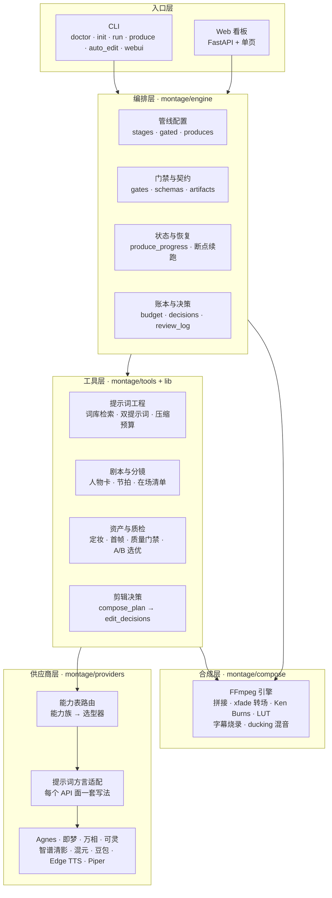
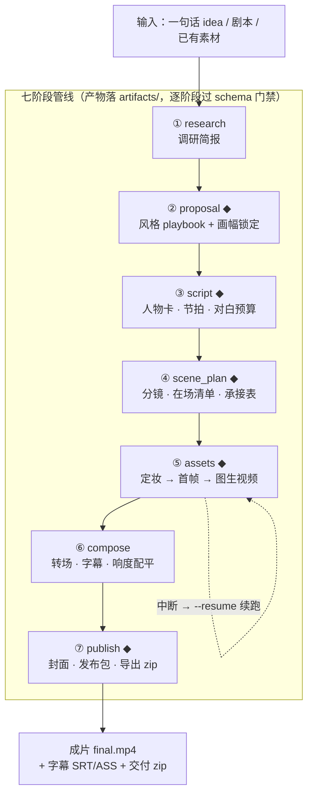

[中文](README.md) | [English](README.en.md)

# montage-core

**中文优先、Agent 驱动的 AI 视频生产系统**

把「AI 视频生产」做成一条可治理、可扩展、有镜头语言的工程管线：给它一个想法或剧本，
它按七个阶段产出带镜头语言、字幕与响度配平的成片；每一步产物都是可校验的 JSON 契约，
随时可停、可审、可续跑。


> 上面这部《宦娘》就是本仓库管线产出的：5 幕 / 36 镜 / 367 秒、1920×1080@30、
> 字幕烧录 + 逐镜响度配平。下面是片中的三个镜头（原始静帧见 [`docs/images/`](docs/images/)）。

| 第一幕 · 山门雨夜 | 第二幕 · 后园听琴 | 第四幕 · 真相 |
|---|---|---|
|  |  |  |

## 30 秒看懂

| 维度 | 规模 |
|------|------|
| 管线 | 3 条（cinematic 剧情 / documentary 纪实 / clip_factory 切片工厂）× 7 阶段 |
| 工具 | 60 个注册工具，19 个能力族 |
| 供应商 | 十余家适配器：Agnes / 即梦（方舟）/ 万相 / 可灵 / 智谱清影 / 混元 / 豆包 / Edge TTS / Piper |
| 风格 | 9 本原创 playbook（Python dict，零 YAML） |
| 知识资产 | 170 条中文词库 + 6 个原创 `.cube` LUT + 音效/音乐索引 |
| 工程 | 约 7.5 万行 Python · 1712 条测试 · 运行时依赖仅 `jsonschema` |

## 架构



## 生产流程



◆ = 门禁 / 人工确认停点（`await_*`）。停点状态写在 `artifacts/produce_progress.json`，
Agent 与人都读同一份事实来决定下一步。

## 工程亮点

1. **契约治理，不是脚本堆叠**：每个阶段的产物都是经 JSON Schema 校验的 artifact；
   `engine/gates.py` 在 checkpoint 完成时校验「produces 存在 + schema 合法」，不合法即拦，
   并支持 `MONTAGE_RELAX_GATES=1` 显式降级；产物原子写，预算封顶 + settlement append-only 对账。
2. **能力表驱动的多供应商路由**：不按供应商名写 if/else——能力表声明「哪个 API 面支持什么」，
   选型器按能力族路由；每个 API 面有独立的提示词方言档案（字符上限、引用语法、音频语法、
   禁用符号），不合格就不发请求，而不是硬发再重试。
3. **断点续跑与成本可控**：`produce_progress.json` 记录停点与下一步参数，任何阶段中断都能
   `--resume`；生成前 `dry_run` 预估费用、超预算不打 API；`--retry` 二次确认后只重跑指定镜；
   生成缓存按提示词 + 参考图指纹命中。
4. **时基与响度这类「看不见的坑」有确定性防线**：拼接前逐片段归一（scale/pad/fps/48kHz）、
   xfade 转场 offset 按帧对齐、EBU R128 响度配平；`film_health` 检查 PTS 断档、冻结帧、
   段间响度落差，把「播放器里表现为定格」的问题拦在交付之前。
5. **提示词工程沉淀为知识资产**：170 条中文结构化词库 + 公有领域剧本范式 + 五层镜头语言；
   每镜产出「首帧图 + 视频动态」双提示词；压缩有硬预算，但动作与台词永不删。

## 快速开始

```bash
cd montage-core
pip install -e .                  # 核心依赖只有 jsonschema
copy .env.example .env            # PowerShell: Copy-Item .env.example .env

# 零密钥即可跑的两条演示（本地确定性工具）
python examples/pipeline_flow.py
python examples/zero_key_edit.py  # 需 MONTAGE_REAL_FFMPEG=1

python -m montage doctor          # 看哪些供应商变成 available
python -m montage init <id> --title "项目名"
python -m montage produce <项目目录>                    # 配乐→拼片→finish→发布包→zip
python -m montage produce <项目目录> --retry sh01 --yes  # 重跑指定镜（先预览费用）
python -m montage auto_edit <dir> --video raw.mp4 --style documentary
python -m montage webui --port 8399                     # 需 pip install "montage-core[webui]"
python -m pytest -q               # 1712 条测试
```

系统需 `ffmpeg` / `ffprobe`。密钥只写在仓库根 `.env`（已在 `.gitignore` 中，不要 `git add`）。

## 目录结构

```
montage-core/
├── montage/
│   ├── toolbase.py          # BaseTool 契约（ToolResult / 状态 / 成本估算 / 输入校验）
│   ├── registry.py          # 工具注册表 + 能力选型 + 能力菜单
│   ├── schemas.py           # 规范产物 JSON Schema（script 含人物卡/节拍）
│   ├── pipelines.py         # cinematic / documentary / clip_factory 管线配置
│   ├── cli.py               # doctor/tools/init/status/check/run/produce/auto_edit/webui
│   ├── engine/              # stages / artifacts / budget / decisions / gates / produce
│   ├── tools/               # 词库检索 / 视觉提示词 / 剪辑顾问 / 剧本校验 / 质检
│   ├── providers/           # 能力表 + 方言适配 + 各供应商适配器
│   ├── playbooks/           # 9 个原创风格 playbook（Python dict，无 YAML）
│   ├── compose/             # FFmpeg 合成 + 音频配平 + LUT 调色 + 平台档案
│   └── webui/               # FastAPI 服务 + 单页看板
├── lib/                     # 确定性知识模块（提示词装配、在场清单、资产检索）
├── prompt_library/          # 170 条中文结构化词条（来源见 CREDITS.md）
├── assets/                  # 开源媒体资产库（音效/音乐/LUT/字体索引 + 许可证）
├── docs/                    # AGENT_GUIDE / DIRECTOR_GUIDE / REVIEWER / ROLES / ROADMAP
├── examples/                # pipeline_flow / zero_key_edit
├── scripts/                 # minitest / make_luts
└── tests/                   # 1712 条测试
```

## 设计取舍

- **运行时依赖只有 `jsonschema`**：供应商 HTTP 走标准库 `urllib`，克隆下来就能跑，
  不靠依赖树撑场面。
- **配置用 Python dict 而非 YAML**：可 import、可类型提示、可单测，少一层解析与 schema 漂移。
- **不引入 Remotion / Node 运行时**：产品形态是「拼接 AI 片段」，FFmpeg 已覆盖；
  多一个运行时会拆开仓库。
- **借鉴 OpenMontage 的功能清单，实现 100% 自创**：对方是 AGPL-3.0，
  抄代码会污染本仓的 MIT 许可。

<details>
<summary><b>能力总览（展开）</b></summary>

- **管线引擎**：research → proposal → script → scene_plan → assets → compose → publish，
  门禁审批、历史归档、产物校验、成本账本、决策日志；3 条管线。
- **契约治理**：独立 gates 层在 checkpoint 完成时校验 produces 产物存在 + schema
  （`MONTAGE_RELAX_GATES=1` 可降级）；`check --caps` 能力族白名单；预算封顶与
  settlement append-only 对账；选型器单例路由缓存；产物原子写。
- **合成**：`compose_planner` 把每镜转场/LUT/字幕槽写成 `compose_plan` 并编译为
  `edit_decisions`（assemble 只读后者）；FFmpeg 拼接 / xfade 转场（cut / crossfade /
  fade_black / wipe / 负空隙）/ Ken Burns 静态图运镜 / 裁剪 / 字幕烧录（支持 ASS 样式）/
  旁白 + 配乐混音（assemble 默认 ducking + loudnorm）/ 整片装配 / LUT 统一调色 /
  平台档案出片 / 配音装配。
- **生成策略**：`shot_runner` 编排定妆照 → 首帧 → 质检 → 图生视频（默认 `dry_run`，
  超预算不打 API）；`asset_quality_gate` 质量门禁、`asset_picker` A/B 选优、
  `generation_cache` 生成缓存、镜头分层成本（过渡/空镜走静态图 + Ken Burns）。
- **剧本质量层**：人物卡（`characters[]`）/ 故事节拍 / 角色注册表进 schema；
  `script_validator` 确定性门禁（对白预算按供应商时长网格、可拍性、人物引用一致性）；
  逐镜「在场清单 + 承接表」防止模型漏承接上一镜的人物/道具/方位。
- **提示词工程**：中文词库确定性检索（零依赖）、逐镜「首帧图 + 视频动态」双提示词、
  剪辑转场确定性顾问、公有领域剧本范式库。
- **风格 playbook**：中文优雅 / 赛博朋克 / 日系治愈 / 纪实克制 / 少年漫 / 漫画分镜 /
  口播讲解 / 国潮动漫真实风 / 追逐喜剧（9 本），proposal 锁定后贯穿全片。
- **开源资产库**：音效索引（Sonniss GDC）、音乐索引（FreePD / incompetech，BPM 卡点）、
  原创调色 LUT（6 个 `.cube`，`scripts/make_luts.py` 生成）、字幕字体指引（思源黑体 OFL）。
- **成片收尾**：`produce` 在拼接后跑 finish（显式 LUT / 平台档案 / 2s 片头 / 字幕旁路）
  与 `release_pack`（封面抽帧 + 三平台简介模板 + `publish_log`），再打 zip。
- **Web 看板**：项目列表、阶段进度、产物浏览、预算、决策记录、checkpoint 一键写入；
  播放 `renders/final.mp4`；`--retry` 二次确认后重跑指定镜。

</details>

## 供应商契约分级

- **确定**：配好密钥即可按官方契约调用 — 即梦图/视频、万相图/视频、智谱清影、Agnes 图片、
  DashScope ASR、豆包 TTS、Edge TTS。
- **待联调**：接口已写，需真实密钥核对 — 可灵图/视频、混元视频、Agnes 视频/配音、
  豆包 Seed-Audio、talking_head / lip_sync。
- **仅接口**：占位，未接供应商 — `music_gen`。

## 生态（Ecosystem）

montage-core 按依赖方向拆出两个可独立使用的库（行为与主仓对应层一致）：

- **[montage-providers](https://github.com/1084669403/montage-providers)** — 国产多供应商
  视频/图像/TTS 统一 SDK：能力表驱动路由、逐 API 面「提示词方言」、黄金 fixture 契约测试，
  零第三方依赖。
- **[montage-composer](https://github.com/1084669403/montage-composer)** — 纯 FFmpeg
  合成工具库：xfade 转场链、Ken Burns、LUT 调色（含 6 个原创 LUT）、字幕、ducking 混音、
  平台出片档案，零第三方依赖。

> 演示视频待补：TODO(demo video)。

## 许可证

MIT。代码为全新原创实现；`prompt_library/` 词条来源见
[`prompt_library/CREDITS.md`](prompt_library/CREDITS.md)（MIT 开源仓库精选改写，保留版权声明）。
