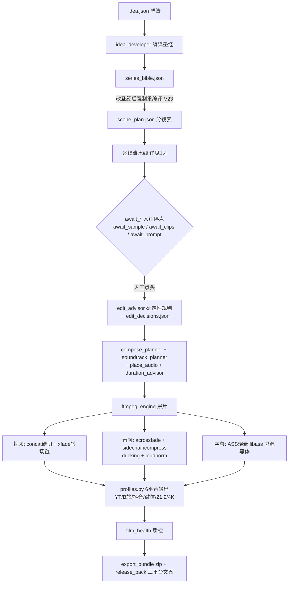
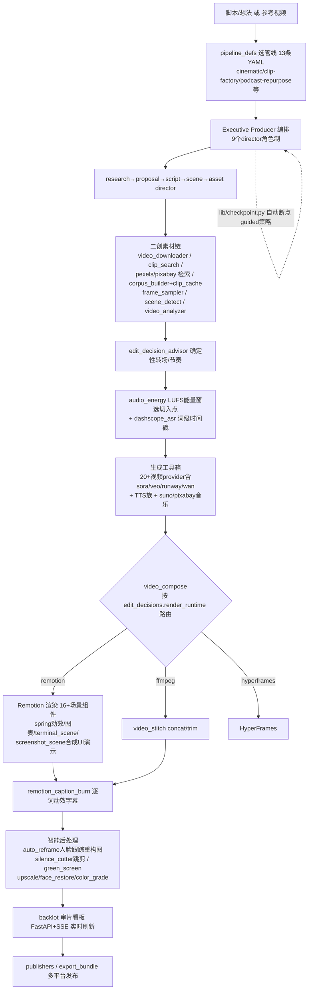
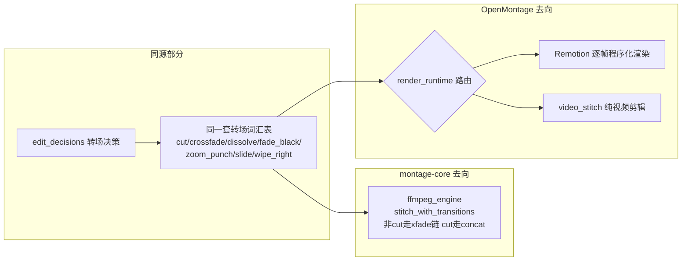
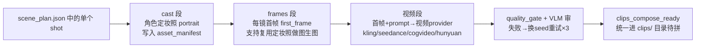

# COMPARISON — montage-core vs OpenMontage：分镜合成与剪辑能力对比报告

> 调研对象：OpenMontage（同源分支项目，本地检出目录略）。
> 覆盖需求：①分析 OpenMontage 每个分镜合成与剪辑等后期功能；②与 montage-core 逐项对比；③点出可取之处并详述；④流程图级对比；⑤双方优缺点清单。
> 可实施结论已另立实施计划：[OPTIMIZATION_PLAN.md](OPTIMIZATION_PLAN.md)（含六角度复核与淘汰/降级记录）。

## 0. 一句话结论

两项目**同源**（转场词汇表完全一致：`fade_black`/`zoom_punch`/`crossfade`/`dissolve`/`slide` 双方 advisor 都在用），但后期路线已分叉：**montage-core = 确定性 FFmpeg 工程路线**（单镜三段式流水线 + 状态机 + 缓存 + 质量门，强在"可控"）；**OpenMontage = Remotion 程序化渲染路线**（16+ 场景组件 + 实时预览 + 57 工具箱，强在"表现力"与"素材复用"）。双方剪辑智能都是确定性规则 advisor，且都没有帧级音乐卡点。作为二创项目，OpenMontage 的素材获取/复用链明显更完整。

## 1. 流程图对比（四层）

### 1.1 端到端：montage-core（确定性状态机路线）

### 1.2 端到端：OpenMontage（Agent 编排 + Remotion 渲染 + 二创素材链路线）

### 1.3 同环节分叉点对照（核心差异可视化）

关键分叉：同一个 `edit_decisions`，montage-core 只能落到 FFmpeg（`montage/compose/ffmpeg_engine.py:670` 按转场定义拆 concat/xfade），OpenMontage 能按 `edit_decisions.render_runtime` 路由到 Remotion 做帧级程序化渲染（`tools/video/video_compose.py:7-16`），且用 `proposal_packet` 做 runtime_swap 检测防止渲染运行时被偷换。

### 1.4 单镜级（"每个分镜"）合成链路对比

**montage-core：三段式单镜流水线**（最有特色的设计，镜与镜之间有统一契约）：

要点（`montage/tools/shot_runner.py`）：入口收 `asset_manifest` + `stage` 枚举 `cast/frames/prompt_preview`（`shot_runner.py:201-202`）；`prompt_preview` 只构建提示词写 `shot_prompts.json` 不落盘媒体；产出经 `clips_compose_ready`（`shot_runner.py:121`）、`first_frame_item`/`frames_missing`（`shot_runner.py:144-145`）等守卫函数核验后才算 ready；嵌套 shots 会 lift 成 shot_prompts（`shot_runner.py:4`）。**关键优势：角色定妆照跨镜复用 → 人物一致性；首帧先行 → 视频生成可控性。**

**OpenMontage：无统一单镜契约**。每个场景/片段由 Agent 在 pipeline 各阶段按需调用工具（视频生成工具单镜调用、Remotion 场景由 draft JSON 定义、素材剪辑由 `video_trimmer` 处理），工具间没有"定妆照→首帧→视频"的强制依赖链，人物一致性靠各视频 provider 自己的 reference 参数（如 kling 的 element/motion control，`kling_official_video.py:598+`）。

**小结**：单镜可控性 montage-core 明显更强（契约化、可断点、可重试）；OpenMontage 单镜灵活但一致性依赖模型能力与 Agent 发挥。

## 2. 逐维度对比（15 维）

| # | 维度 | montage-core | OpenMontage | 优胜方 |
|---|------|-------------|-------------|--------|
| 1 | 渲染运行时 | 仅 FFmpeg（`ffmpeg_engine.py`） | 三路由 Remotion/FFmpeg/HyperFrames（`video_compose.py:7-23`） | OM（表现力上限） |
| 2 | 场景类型 | 视频片段/图片+Ken Burns 两种素材类型 | 16+ 程序化场景（`SCENE_TYPES.md`）：text_card/hero_title/stat_card/callout/comparison/4种图表/progress_bar/anime_scene（粒子+运镜）/terminal_scene（免录屏终端动画）/screenshot_scene（合成UI演示：光标/点击脉冲/打字气泡） | OM |
| 3 | 动效/转场 | 8 种转场映射 xfade（`ffmpeg_engine.py:456-472`；`zoom_punch`/`blur` 实际降级为 fade） | spring/interpolate 逐帧动效 + ken-burns + zoom-in + 逐词字幕高亮 | OM |
| 4 | 字幕 | ASS 静态样式（白字黑描边思源黑体安全区，`subtitle_builder.py:95-136`），libass 烧录 | `dashscope_asr` 词级时间戳 → `remotion_caption_burn` 逐词动效 | OM（短视频显学） |
| 5 | 音频混音 | 真 sidechaincompress ducking + loudnorm + acrossfade 链（工程化强） | `audio_mixer` + `audio_energy` LUFS 瞬时响度滑窗找"最响窗口"选 BGM 切入段（`tools/analysis/audio_energy.py:223-251`） | 混音质量 mc；选段智能 OM |
| 6 | 剪辑智能 | `edit_advisor.py:29-83` 语义字段驱动（camera_energy/hero_moment → cinematic/documentary 风格规则） | `edit_decision_advisor.py:98-186`（场景类型+相邻时长节奏驱动，documentary 白名单禁花哨转场） | 同源同构，规则复杂度相当 |
| 7 | 音乐卡点 | 无帧级 beat/onset 检测 | 能量窗只算"选哪一段"，不算"切点对齐重拍" | **双方都缺**（机会点） |
| 8 | 二创素材链 | 仅 `downloader.py`（URL 下载，SSRF 防护）+ `stock_retriever.py` + `asset_retriever.py` | 完整链：`video_downloader`→`clip_search`/`direct_clip_search`→`video_selector`→`corpus_builder`+`clip_cache`（带 manifest 的片段字节缓存，`clip_cache.py:128`）→`frame_sampler`/`scene_detect`/`video_analyzer`（VLM 看参考片：分镜结构/节奏分类/管线建议，`video_analyzer.py:591-679`）→`transcript_fetcher` | **OM（二创核心场景）** |
| 9 | 智能后处理 | `enhance.py` 三件套：Upscaler（realesrgan→lanczos 降级）/BgRemover（rembg→chromakey）/FaceRestorer（`enhance.py:61-217`） | `auto_reframe`（人脸跟踪 16:9→9:16，MediaPipe/OpenCV，`auto_reframe.py:1-11`）、`silence_cutter`（ffmpeg silencedetect 跳剪，remove/speed_up/mark 三模式）、`green_screen_composite`/`video_blend_layer`、增强族（color_grade/upscale/face_enhance/eye_enhance/bg_remove） | OM（reframe/跳剪是 mc 缺失） |
| 10 | 数字人/口播 | `talking_head.py` provider（对口型） | avatar 四件套：`kling_avatar`/`kling_lip_sync`/`lip_sync`/`talking_head` + heygen_video | 大体对等，OM 略广 |
| 11 | 预览/审片 | webui 只读浏览（`webui/server.py` 仅 GET 接口） | `npx remotion studio` 实时预览 + backlot 审片看板（`backlot/server.py:1-4` watchfiles+SSE 推送，项目一变浏览器自动刷新） | OM |
| 12 | 断点续跑 | `produce_progress.json` + 7 个 `await_*` 强制人审停点（`produce.py:326`），人不能缺席 | `lib/checkpoint.py` 自动持久化 + `default_checkpoint_policy: guided`（`cinematic.yaml:9`） | 取舍：确定性 vs 自动化 |
| 13 | 编排/缓存/质量门 | Python 硬编码状态机（可复现）+ sha1 参数哈希生成缓存 + 3 次换 seed 重试 + VLM 双闸 + 预算门（`produce.py:276`）+ ffmpeg 能力探测（`ffmpeg_compat.py:114-116` 对 lut3d/aformat/xfade_cut 真实探测降级） | 13 条 YAML 由 **Agent 当编排器**（自评弱项：无运行时编排器、Agent 波动）；阶段级 `max_revisions_per_stage: 3`；`clip_cache` 只缓存语料片段、**无生成结果缓存**；有 cost_tracker；EP 质量门（情感节奏/色彩/音频动态）+ proposal 锁定 + runtime_swap 检测 + `composition_validator` 渲染前预检 | **mc（生产纪律全面领先）** |
| 14 | 交付 | export_bundle zip + release_pack 三平台文案；6 平台 profile（`profiles.py:41-64`）但横→竖是 **scale+pad 加黑边**（`profiles.py:35-36`；注意 provider 已支持 9:16 直出，黑边仅发生在跨平台衍生时） | publishers 直接对接发布渠道 + `auto_reframe` 内容感知重构图 | OM（多平台适配） |
| 15 | 单镜契约 | 三段式 cast→frames→视频，定妆照跨镜复用，`clips_compose_ready` 守卫 | 无统一单镜契约，一致性靠 provider reference 参数 | **mc（人物一致性/可控性）** |

**总体**：生产纪律（单镜契约/缓存/断点/质量门/预算/能力探测）mc 全面领先；画面表现力（场景组件/动效/字幕/预览）、二创素材链、智能后处理 OM 领先。互补而非替代。

## 2.5 中间产物契约对比（对优化最有参考价值）

| 产物 | montage-core | OpenMontage |
|------|-------------|-------------|
| 分镜表 | `scene_plan.json`（圣经编译产物，shot 含语义字段 camera_energy/hero_moment） | draft JSON（Remotion props，如 `titled_video_props.json`：videoSrc/tagline/fontSize 等扁平 props） |
| 剪辑决策 | `edit_decisions.json`（转场+节奏，assemble 唯一运行时契约） | `edit_decisions.json` + **`render_runtime` 字段**（渲染路由扩展点） |
| 状态/断点 | `produce_progress.json`（status + next.argv，人审驱动） | pipeline checkpoint（`lib/checkpoint.py`，guided 策略） |
| 素材清单 | `asset_manifest`（items + reference_assets，定妆/道具索引） | corpus manifest（`clip_cache.py` CacheEntry 行）+ proposal_packet |
| 质检记录 | review_log + `artifacts/REVIEW.md`（多角色评审纪律） | EP 阶段质量门报告 + backlot 看板状态 |

启示：mc 的产物契约围绕"人审状态机"，OM 的围绕"Agent 交接棒"。mc 引入 `render_runtime` 字段即可无损扩展渲染路由（OM 已验证此契约兼容）。

## 3. 双方优缺点清单

### montage-core

**优点**：
1. 三段式单镜流水线，定妆照跨镜复用保人物一致；
2. sha1 生成缓存 + 换 seed 重试，重跑不重复花钱；
3. 真 sidechaincompress ducking / loudnorm 音频工程化；
4. `await_*` 人审状态机 + `next.argv` 可恢复，结果可复现；
5. VLM 双闸 + film_health + 预算门多层质量兜底；
6. ffmpeg_compat 能力探测，旧版 ffmpeg 自动降级不炸。

**缺点**：
1. 仅 FFmpeg 渲染，图表/文字动效/合成UI做不了；
2. 横转竖 scale+pad 黑边（仅跨平台衍生场景）；
3. 字幕静态 ASS 无逐词动效；
4. webui 只读无预览审片；
5. 二创素材链薄（只有下载+检索，无参考片分析/语料库）；
6. `narration_path` 缝隙（TTS 轨衔接靠手工，`narration.py:64-100`）；
7. 无跳剪/reframe 后处理；
8. **剪辑决策无预先规划阶段**（assemble 时才由 advisor 定转场，节奏无人审）。

### OpenMontage

**优点**：
1. Remotion 16+ 场景组件 + studio 实时预览，表现力天花板高；
2. `render_runtime` 三路由 + composition_validator 预检；
3. 词级 ASR 字幕；
4. 二创素材链完整（下载→检索→语料→VLM 分析参考片→管线建议）；
5. auto_reframe / silence_cutter 智能后处理；
6. backlot SSE 审片看板；
7. 13 条 YAML 管线场景覆盖广（含 podcast-repurpose / localization-dub 等二创向）。

**缺点**：
1. Agent 当编排器，无运行时执行器，结果有波动（其自评弱项）；
2. 无统一单镜契约，人物一致性靠模型；
3. 无生成结果缓存（仅语料 clip_cache），重跑重复花钱；
4. 混音无 ducking/loudnorm 工程化；
5. beat 卡点同样缺失；
6. 项目目录散落一次性脚本（其自评）。

## 4. OpenMontage 可取点（原始清单 → 复核后采纳情况）

> 原始调研提出 10 项；经六角度复核（技术可行性/工作流契合/真实收益/成本/兼容风险/重复度）后，采纳 7 项进 P0、3 项降级条件性、1 项淘汰。**逐项复核过程与结论见 [OPTIMIZATION_PLAN.md](OPTIMIZATION_PLAN.md) §1。**

| 原始可取点 | 复核后去向 |
|-----------|-----------|
| 词级 ASR 字幕 | 采纳 P0（ASS karaoke `\k`，不必上 Remotion） |
| audio_energy LUFS 能量窗 | 降级 P1 条件性（价值取决于曲库长度 vs 成片时长） |
| silence_cutter 跳剪 | 采纳 P0 但限定范围（native 出声/实拍素材） |
| auto_reframe 人脸跟踪 | 降级 P1 条件性（provider 已 9:16 直出，仅跨平台衍生需要） |
| 二创素材检索链 | 保留 P1（确认需求后做） |
| SSE 审片看板 | 采纳 P1 |
| Remotion 渲染运行时 | 降级 P2 条件性（维护成本高、场景占比低） |
| beat 卡点 | 拆分：bpm 拍网格 P0（曲库已知 bpm，无需 librosa）；librosa 细化 P2 |
| 多 provider 广度 | P2 按需 |
| 修 narration_path 缝隙 | 采纳 P0 |

## 5. 结论

- 短期优化重心不在"换渲染引擎"，而在**补生产纪律的最后一环**：剪辑决策的预先规划与审查（剪辑导演角色 + edit_plan 帧级契约）。
- OpenMontage 最值得吸收的是**词级字幕**与**审片看板**；其 Remotion 路线作为期权保留（`render_runtime` 字段预留）。
- 音乐卡点是两项目的共同空白，而本项目曲库自带 bpm（`soundtrack_planner.py:249`），做**帧锚定节拍网格**成本极低、收益独特——做完即领先两个项目。
