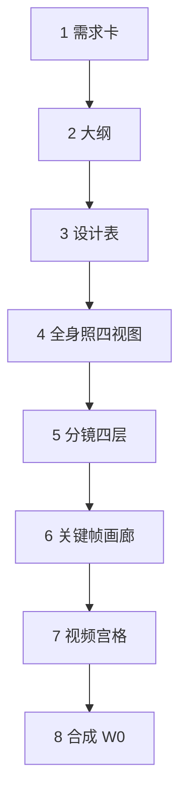

# montage-core 进化方案（融合主文）

> **现行实施依据。** 取代 [archive/EVOLUTION_PLAN.md](archive/EVOLUTION_PLAN.md)（V1）、[archive/EVOLUTION_PLAN_V2.md](archive/EVOLUTION_PLAN_V2.md)、[archive/EVOLUTION_PLAN_V3.md](archive/EVOLUTION_PLAN_V3.md)。落盘本文时不改生产代码；落实从 P-D0 起改代码。

本文合并原先两份方案：模型 API、Agnes 冻结、P0–P6，与 Pavo 截图校准的导演八步。**只保留这一份**作为实施依据。

官方页部分需登录（火山方舟、可灵开放平台），下列契约以 2026-08 可核对的官方/镜像为准；**精确 model ID 以控制台为准**，实现时用环境变量覆盖，禁止写死猜测值当生产默认。

章节顺序（实施/审阅按此读）：约束 → 为何做软件 → 模型 API → 手搓 SOP → 公共/差异 → 提示词库 → 三档 review → **导演八步（含缩略/展开）** → 分阶段任务 → 风险 → 审阅对照 → 落盘。

---

## 0. 口述需求整理（作为方案约束）

- **供应商范围**：视频生成只深做即梦 / 可灵 / Agnes；其余接口保留、走通用兜底。
- **主用模型**：即梦最新两款 = **Seedance 2.5**（长叙事/多模态）+ **Seedance 2.0 Pro**（高分辨率高质量）；可灵最新两款 = **Kling 3.0 Omni**（一场多镜 + 原生音频）+ **Kling 2.1 Pro**（图生视频旗舰）；Agnes **继续 2.0**，官方 2.5 仍标 pre-release，**可稳定生产后再切、再弃 2.0**。
- **路由原则**：三家都有的能力走**同一条公共路径**（能力表注入，不按供应商名 if/else）；只有某家独有的能力才分叉，且必须可降级。
- **提示词原则**：图/视频 API 的语言、长度、引用语法、禁忌、时长网格不同。必须在**进入生成路径之前**按目标 API 定死写法：机器可读档案 + `prompt_library/video_gen/` 知识页。不合格就拆镜或降级，绝不硬发。
- **D8 Agnes 2.0 提示词冻结（用户拍板）**：现有闭环规定**不要动**。即 `agnes_audio` 路径、中文分节（【台词】【声音】【音频锁定】等）、压缩后英文画质层、`default_english_negative_prompt()`、`provider_max_chars=3000`、`check_agnes_audio_prompts`、`_payload_v20` 的 prompt/negative 组装。官方「英文六段式」只作对照说明，**不得改写仓库 Agnes 2.0 方言**。adapter 对该档 `passthrough`。2.5 才允许新写法。即梦/可灵/v30/方舟档案可以按官方调整。
- **D5 人审（Pavo 融合）**：cinematic **推荐**走八步（`--review director`），每步「机器出草稿 → 人确认 → `--resume`」。**CLI 默认仍是 `--review bible`**（测试与现有 Skill 两段式）。不是发明 `--autopilot`，也不是 8 套新 CLI。进度仍写 `produce_progress.status=await_*`。`--review none` 无人值守。
- **D5 展示（本轮补）**：每步默认只给**缩略摘要**（几行关键值 + 过/重抽）。用户要调整时**展开全部可改字段**，并列出该字段的**合法选项**（playbook、画幅、景别、运镜等），不要把整份 JSON 甩给人。磁盘上的 bible/scene_plan 始终存全量；缩略只影响 REVIEW/WebUI。
- **产品目标**：尽量少消耗导演精力，但关键处一定能改，成片质量对齐这些平台人工手搓的电影级结果。
- **项目约束（不可破）**：MIT；代码与提示词自创；不发明 `--autopilot`；不写「一句 idea 出片」；机器收口只用 `approved_by=produce`，永不伪造 `human_approved`。八步里人对过的阶段才写 `human_approved`（proposal/script/scene_plan/资产确认）。`--idea` 在 director 模式下按八步停，而不是一次编完全部分镜。

「电影级」六维验收（沿用，但判据要对新模型）：

- C1 一致：同角色跨 ≥5 镜不漂。即梦/可灵：定妆 + 职责句 + 场记进方言。Agnes 2.0：定妆/关键帧 URL + 现有 prompt 规定，**不算 C1 失败**。验收用固定夹具角色 + 抽帧协议（P3），不写无法 CI 的「命中率」。
- C2 镜头语言：每镜运镜可解释。缺运镜可补 `shot_language` 空字段；Agnes 2.0 **不改** builder 模板。补数据会改变该镜用词，这是分镜数据不是「规定」。默认仍补空（含 Agnes）；要冻结用词时在 bible 写 `fill_shot_language=false`，不要按 `video_loop=agnes` 静默关补全。
- C3 光影：跨镜 LUT 一次。原生有声成片不要再套一层强 LUT 导致和模型色脱节——`lut_strength` 沿用现有，不新开调色哲学。
- C4 对白：对白镜优先原生音频。`audio_source` 已有 `jimeng_prompt`；`keep_embedded_audio` 今天只认 Agnes，P2 必须认 Seedance/Kling。禁止默认 TTS 旁白。Seedance `{台词}` 不要和 `subtitle_builder` 双烧字幕（默认不烧【字幕】符号）。
- C5 节奏：能一次生成的长镜头不切碎；`cut=hard` / 换 `location_id` 禁止合成单次 2.5/Omni 调用。
- C6 硬伤：确定性 gate + VLM；VLM `kind` 枚举写进 schema（人物不一致/道具丢失/场景错位/崩坏/构图）。

少人工度量：导演档 **八步确认（可缩略）**；轻量档仍是圣经 + 样品；无人值守 `--review none`。机器判不过带 `proposed_fix`。

---

## 1. 为什么软件层还值钱

可灵 3.0 / Seedance 2.5 已经把「一场多镜、原生音频、多参考、局部编辑」做成模型能力。montage-core 若只做「逐镜 5s + 拼贴 + 后叠 TTS」，会追不上手搓。

不可被模型替代、必须做成护城河的是：跨供应商编排、能力表降级、提示词方言校验、成本账本、样品/返工、确定性门禁、可审计决策日志、**导演停点上的缩略确认卡**。本方案在现有 W0–W6 上做增量，不推翻七阶段与 produce。

---

## 2. 主用模型 × API 面（官方对齐，不是改 req_key）

现仓库与目标面是**两套协议**，V3 写成「升级版本号」会做错落点。

### 2.1 即梦 / Seedance

现状：[../montage/providers/jimeng.py](../montage/providers/jimeng.py) 走**视觉智能** `CVSync2AsyncSubmitTask` + HMAC V4 + `req_key`（`jimeng_t2i_v40` 图；视频全是 **v30 家族**，5/10s，首尾帧 `i2v_first_tail`，运镜 `recamera`）。

目标主用走**火山方舟视频生成 API**（官方：[创建任务](https://www.volcengine.com/docs/82379/1520757)，教程/提示词：[Seedance 2.5 教程](https://docs.volcengine.com/docs/82379/2607688)）：

- 创建：`POST /api/v3/contents/generations/tasks`
- 查询：`GET /api/v3/contents/generations/tasks/{id}`
- 鉴权：方舟 API Key（Bearer），**不是**现有 `VOLC_ACCESSKEY` HMAC 那条视觉智能链
- 请求核心：`model` + `content[]`（text / image_url / video_url / audio_url）+ `duration` / `ratio` / `generate_audio` / `watermark` / `return_last_frame`

两款主用（控制台核对 ID）：

- **Seedance 2.5**（如 `doubao-seedance-2-5-260628`）：单次约 **4–30s**（或 `-1` 智能时长）；多模态参考约 **图 0–30 + 视频 0–10 + 音频 0–10**；`generate_audio` 原生声画；任务类型 generate / **edit / extend**；首帧/首尾帧（有锁定时 `ratio=adaptive`）；提示词用中文叙事 + 时间戳分段 + `@图片N` 职责绑定 + 符号 `(音乐)` `<音效>` `{台词}` `【字幕】` + Negative Prompt。公开资料常见输出 **480p/720p**（2.5 不一定有 1080p）。
- **Seedance 2.0 Pro**：同一方舟任务面；时长约 **4–15s**；参考额度更小（约图 0–9、音视频各 0–3）；**1080p/4k** 更完整；同样原生音频、首尾帧、多镜头叙事。适合 hero 要高分辨率、时长 ≤15s 的镜。

v30 家族**保留为降级**：方舟未开通、2.5 联调失败、只要 recamera 模板、或预算走旧刊例时。不要删 `jimeng_*_v30*`。

图：定妆/四视图仍可用现有 `jimeng_t2i_v40`（视觉智能），不必等 Seedance 视频面。同一镜可能 **图走 HMAC、视频走方舟 Key**，doctor 要分别报缺钥。

**注入器缺口（P1 必写）**：现有 `apply_video_frames` 只填扁平 `image_url` 字段，**填不了**方舟 `content[]` 多模态数组。不要硬扩成万能函数；P1 为方舟单开 `apply_seedance_content`（text + 参考图/音视频 + 首尾帧 role）。生产请求默认 `watermark=false`。`return_last_frame=true` 接现有衔接 2b，有官方尾帧就不要再 `extract_last_frame`。dry_run 按 token/时长新估，禁止沿用 v30 元/秒。

**`_prompt_inputs` 陷阱**：今日 `vid_prov == "volcengine"` 会开 `jimeng_prompt` 且 `provider_max_chars=800`。若方舟适配器仍 `provider=volcengine`，2.5 长提示词会被截断。P2 必须按 **API 面**（`seedance_25` vs `jimeng_v30`）设 builder 开关，不能只看 provider 字符串。

### 2.2 可灵

现状：[../montage/providers/kling.py](../montage/providers/kling.py) `kling-v1`，`/v1/videos/text2video|image2video`，Bearer `KLING_API_KEY`，`contract=pending-verify`，无 JWT 双密钥、无尾帧、无 Omni。

官方开放平台入口：[klingai.com/document-api](https://klingai.com/document-api/quickStart/productIntroduction/overview)。鉴权常见 **AK+SK 签 JWT**（实现时按官方 QuickStart 改，现 Bearer-only 不够）。

两款主用、**两个 endpoint**（不能只改 `model_name`）：

- **Kling 3.0 Omni**：`POST /v1/videos/omni-video`，`model_name` 以控制台为准（镜像常见 `kling-v3-omni` / `kling-3.0-omni`）。时长 **3–15s**；`mode` std/pro/4k；`sound=on|off`（默认 off，对白镜必须显式 on）；`image_list` 可含首帧/尾帧（**有尾帧必须同时有首帧**）；提示词用 `<<<image_N>>>` 引用，最长约 **2500**；`multi_shot` + `shot_type=customize|intelligence` + `multi_prompt` **1–6 镜**；`video_list` 编辑(`base`)或特征参考(`feature`)，这两种 **sound 必须 off**。无参考视频时图+元素 ≤7，有参考视频 ≤4。
- **Kling 2.1 Pro**：仍走 `POST /v1/videos/image2video`，`model_name` 如 `kling-v2-1`，`mode=pro`（1080p）。时长 **5 或 10s**；`image` 必填；`image_tail` 尾帧（pro）；`negative_prompt` 最长约 2500；**无文生、无原生音频、无 multi_shot**。这是「单镜高画质 i2v」旗舰，不是 3.0 的降级号。

现 `kling-v1` 仅作未开通 2.1/3.0 时的占位。

图：可灵生图从 `_NO_IMAGE` 补到与官方字段一致。闭环：[../montage/engine/policy.py](../montage/engine/policy.py) `VIDEO_LOOP_PROVIDERS` **必须加 `kling`**。

**注入器缺口**：Omni 的 `image_list` 是 `{image_url, type}` 对象数组（首帧/尾帧/主体），不是一根 `image_url`。P1 单开 `apply_kling_omni_refs`，不要把 `apply_video_frames` 拧成两种 schema。2.1 Pro **无首帧就禁选**（纯文生只能走 Omni 或降级）。生产 `watermark_info.enabled=false`。P1 先接 legacy `/v1/videos/omni-video`；JWT 与 Bearer 并存写进 `.env.example`。

### 2.3 Agnes

> **状态（2026-08）：** 生产默认已切 `agnes-video-2.5-flash`（`api_id=agnes_v25`）。下文「2.0 主用 / 2.5 preview」是当时冻结记录，**不要再当现行接线**。现行合同见 [../prompt_library/video_gen/agnes.md](../prompt_library/video_gen/agnes.md)；回滚 2.0 才设 `AGNES_VIDEO_MODEL=agnes-video-v2.0`。

现状：[../montage/providers/agnes.py](../montage/providers/agnes.py) 已实现 2.0 回滚 payload + 2.5 Flash 默认（mode 互斥、禁 negative、禁 `videos[]`）。HTTP 契约与官方一致。

- **2.0 主用（提示词规定冻结）**：API 仍是 `POST /v1/videos` + `GET /agnesapi?video_id=`；关键帧 `extra_body.image[]` + `mode=keyframes`；时长 `num_frames=8n+1`；公网 URL；RPM 1。**提示词不以官方营销页的英文六段式为准**，而以仓库已调通的规定为准（D8）：
  - [../montage/tools/shot_runner.py](../montage/tools/shot_runner.py) `_prompt_inputs`：`agnes_audio=True`，`english_visual=False`，`provider_max_chars=3000`
  - [../lib/shot_prompt_builder.py](../lib/shot_prompt_builder.py)：中文分节 + 对白全文写入【台词】；压缩后追加【音频锁定】；`default_english_negative_prompt()`（约 500 字上限）
  - [../montage/tools/script_validator.py](../montage/tools/script_validator.py) `check_agnes_audio_prompts`：要求【台词】/【声音】
  - `_payload_v20` 继续把上述 prompt/negative 原样提交
  - 一致性靠**关键帧 URL / 定妆 URL**，不靠往 prompt 里塞 `@图片1` 或改分节模板
- 官方页上的 `[Subject]+[Action]+[Scene]+…` 只作「厂商建议」附录，**不覆盖 D8**。
- **2.5**（[官方 wiki](https://wiki.agnes-ai.com/en/docs/agnes-video-v25) 仍写 **coming soon / pre-release**）：才允许新方言（`mode` 互斥、`<Picture N>`、禁 negative）。未切默认前不要用 2.5 模板去「优化」2.0。

切换策略：双跑对照稳定后，**另开** `agnes_v25` 档案与 adapter；默认模型再改 2.5，然后弃 2.0。切换时才动 2.0 提示词路径（等于退役）。未稳定不弃、不改 2.0 写法。

图：统一 `agnes-image-2.5-flash`（文生/编辑/多图合成一个模型全覆盖；参考图 URL 或 Data URI，装箱见 `pack_agnes_image`；免费期图/视频 `estimate_cost` 报 0）；视频用图必须先拿到公网 URL。

---

## 3. 平台手搓 SOP → 本仓库落点

把即梦网页 / 可灵网页「导演手搓」拆成 10 步，每步对照 montage 已有与缺口。导演八步（§7）是给人审的停点；下面 10 步是生成技术链，不要混成一套编号。

1. **一句话创意 → 需求卡/圣经**  
   手搓：写题材、时长、风格、禁区。  
   已有：`produce --idea` → `idea_developer` cascade → `await_bible`。  
   缺口：bible 仍由导演（人或 Agent）精修，**不要把 LLM 塞进确定性工具**。director 档拆成 §7 第 1～3 步。少人工 = Agent 按 DIRECTOR_GUIDE 写完草稿，人看缩略卡点头。

2. **人设 / 场景 / 道具资产（一致性的命门）**  
   手搓：可灵元素库、即梦多参考并给每张图「职责」（外貌/服装/不采用背景）。  
   已有：`script.characters[]`、`character_registry` 逐字复制、`reference_assets` 定妆。  
   缺口：四视图 `turnarounds`。职责句（`@图片1用于…不采用背景` / `<<<image_1>>>`）**只写进即梦/可灵方言**。Agnes 2.0 只把多视图变成 `extra_body.image` URL，**不改 prompt 正文**。对应 §7 第 3～4 步。

3. **剧本 + 对白预算贴新网格**  
   手搓：对白按镜头时长写，超时就拆。  
   已有：`script_validator` dialogue_budget，但网格仍偏即梦 5/10。  
   缺口：即梦/可灵的 `duration_policy` 支持 **enum 与 range**（2.5 的 4–30、Omni 的 3–15）。Agnes 2.0 仍用现有 `duration_to_frames`（3/5/10/18），不要为了「统一 range」改它的切段语义。对白镜优先选 `native_audio` 供应商。对应 §7 第 5 步。

4. **分镜 + 镜头语言**  
   手搓：景别、运镜、情绪。  
   已有：`scene_plan` + `shot_language` + `edit_advisor` + DIRECTOR_GUIDE 四拍。  
   缺口：缺运镜时按 `narrative_role` 补（P 后段、便宜、可并行）。对应 §7 第 5 步镜头表。

5. **锁定首帧构图**  
   手搓：先出关键帧再 i2v。  
   已有：`shot_runner` 首帧 + `apply_video_frames`。  
   缺口：四视图/场景图作为首帧或参考，而不是纯文生碰运气。对应 §7 第 6 步。

6. **视频生成（一场多镜 vs 逐镜）**  
   手搓：即梦 2.5 用时间戳写 30s 一段；可灵 3.0 一次最多 6 镜 storyboard。  
   已有：逐镜 + FFmpeg 拼接 + 即梦首尾桥。  
   缺口：`gen_strategy=single_call_multi_shot` 仅当 caps.multi_shot、同场 `location_id`、且 **不是** `cut=hard`。失败回退逐镜。2.5 长镜头：单镜 hero 且时长 ≤30s 可一次生成；**禁止**把多场拼成一次调用。与 W3 pending hero 30%：一次 30s 可能单独超配额 → 该路径须 `--all-video` 或事前拆镜（默认：超 30% 停 `over_hero`，不自动合并）。  
   样品停：`await_sample` 并入 §7 第 7 步前半；若该镜被路由到 2.5 满时长会很贵。样品优先短档（5s 或该镜 `duration` 与 5 的 min），正式 `--resume` 再用满时长。

7. **原生音频 / 对白 / 口型**  
   手搓：即梦 `{台词}` + generate_audio；可灵 sound=on；Agnes 用手搓片内音。  
   已有：TTS + ducking；Agnes `audio_source=agnes_prompt` + `keep_embedded_audio`。schema 已有 `audio_source=jimeng_prompt`，**代码未消费**。  
   缺口：P2 扩展 `keep_embedded_audio`（认 `jimeng_prompt` / Kling native / `video_loop` 新值）；`place_audio` / soundtrack 对片内音镜不要盖对白。无原生音频才 TTS。默认不写 Seedance `【字幕】`，字幕仍走 `subtitle_builder`。

8. **质检与场记**  
   手搓：人眼刷时间线。  
   已有：`asset_quality_gate`。  
   缺口：千问 VLM；`continuity.json` sidecar。即梦/可灵场记可进方言；Agnes 2.0 只 URL/notes。跨集：`episodes.py` 续写读上一集 continuity（补进 P3）。

9. **返工**  
   手搓：即梦 2.5 把成片当 @视频1 做 edit；可灵 Omni `video_list` refer_type=base。  
   已有：`--retry sh01` + cache。  
   缺口：优先走供应商 **edit/extend**（不重编好段）；ffmpeg `retake_segment` 仅当供应商不支持局部编辑。对应 §7 第 7 步勾选重抽。

10. **合成交付**  
    手搓：调色、字幕、导出。  
    已有：compose、LUT、xfade、finish、release_pack、export_bundle。已够强。对应 §7 第 8 步。P 后期才考虑剪映草稿/WebUI 逐帧，**不进 MVP**。

---

## 4. 公共路径 vs 差异分叉

编排只读 [../montage/providers/capabilities.py](../montage/providers/capabilities.py)，禁止在 `shot_runner` 里按供应商名猜参数。扁平首帧/尾帧继续 `apply_video_frames`；**方舟 `content[]`、Omni `image_list[]` 走专用填充函数**，不要把三种 JSON 形状塞进一个注入器。

**公共（形状兼容时才共用）**

- 时长贴网格 → 扩展 `snap_duration`（enum 或 range）；Agnes 2.0 仍 `duration_to_frames`
- 画幅归一化；但 Seedance **首尾帧锁定时 `ratio=adaptive`**，不得强行写成提案 `output_profile` 的 9:16/16:9（会和官方锁定冲突，成片后再 `apply_profile`）
- 异步创建 + 轮询 + 立刻下载（TTL）
- 确定性质量门 + retryable_ids + `notes[]`

**差异（才分叉）**

- 尾帧桥：即梦方舟 / v30 tail / Kling Omni image_list 尾帧（须同时有首帧）/ Kling 2.1 `image_tail` / Agnes 关键帧首尾。可灵 v1 无则只首帧。
- 一场多镜：Seedance 时间戳长提示词 **或** Kling `multi_prompt`。Agnes 无 → 逐镜。
- 原生音频：`generate_audio` / `sound=on` / Agnes 片内 prompt。Kling 2.1 Pro 无 → TTS。
- 关键帧链：仅 Agnes（2.0 extra_body vs 2.5 mode=keyframe）。
- 局部编辑：仅 Seedance 2.5 edit/extend、Kling Omni video_list base。
- 运镜原生：即梦 recamera 仅 v30 兜底；2.5/3.0 多数写进提示词。
- 负向：2.5/2.0 Pro/Kling 2.1/Agnes 2.0 有；Agnes 2.5 无；Kling 3.0 联调前当未知。
- 提示词引用语法：`@图片N` vs `<<<image_N>>>` —— **只在即梦/可灵 adapter**。Agnes 2.0 **没有** citation_syntax 改写。Agnes 2.5 才用 `<Picture N>`。

路由伪流程（`shot_runner` 内一层 `_route_shot`）：读 selector → `video_caps(tool)` → `VIDEO_PROMPT_PROFILES[api_id]` → **若 `passthrough`（agnes_v20）则 builder 输出原样进 payload**，否则中间格式方言化并校验 → 公共注入 → 差异开关 → 输出 `{payload, degraded, notes}`。

选型启发式（写进 caps 数据）：对白镜优先 `native_audio`；无首帧禁选 Kling 2.1 Pro；时长 >15s 优先 Seedance 2.5；同场多镜且 ≤6 且非 hard cut 可走 Omni `multi_shot`；1080p hero 且 ≤15s 优先 2.0 Pro 或 Kling pro；关键帧变形走 Agnes 2.0（passthrough）。

---

## 5. 提示词规范库（进入路径前定死）

两层，缺一不可。

**A. 机器可读档案**（零依赖 dict）

- 新文件 [../montage/providers/video_prompts.py](../montage/providers/video_prompts.py)（及 image 侧同构或同一文件分 IMAGE/VIDEO）
- 按 **API 面** 建档，不是按公司名糊成一份：`seedance_25`、`seedance_20_pro`、`jimeng_v30`、`kling_omni_30`、`kling_i2v_21_pro`、`agnes_v20`、`agnes_v25`
- 每档必有：`language`、`style`、`max_chars`、`required_fields`、`negative`、`seed`、`duration_policy`、`citation_syntax`、`audio_syntax`、`forbidden[]`、`models[]`、**`passthrough`（bool）**
- `agnes_v20`：`passthrough=true`，字段快照当前 builder 合同（中文分节、3000、英文 negative、agnes_audio），**禁止**写成官方英文六段式
- 新 [../montage/providers/prompt_adapter.py](../montage/providers/prompt_adapter.py)：消费 `visual_prompt_builder` 的 `first_frame_prompt`/`video_prompt`（**不替换** builder）。即梦/可灵做方言化；Agnes 2.0 只做长度校验（已 3000）后原样返回

**B. 知识页**（给导演 Agent）

- `prompt_library/video_gen/INDEX.md` 顶部五步：读 caps → 读 profile → builder → adapter（passthrough 则跳过改写）→ 校验失败则拆镜/降级
- 分页：`seedance.md`、`kling.md` 按官方公式写可调方言；`agnes.md` **只记录仓库现行 2.0 规定**（【台词】【音频锁定】负向英文），附录再贴官方英文六段式并标注「非本仓库 2.0 实现」

中间格式 `StandardVisualPrompt` 仅供即梦/可灵 adapter 使用。不要把 `( )` `{ }` `<<<image_1>>>` 写进中间层。Agnes 2.0 不经过该中间层改写。

同一镜头方言（实现时用 adapter 模板；Agnes 为例外）：

- Seedance：中文四段公式 + 长片时间戳 + `@图片1用于…不采用背景` + `{台词}` + Negative Prompt
- Kling 3.0：中文叙事，`<<<image_1>>>` 动作，`sound=on` 时把对白写进 prompt；多镜走 `multi_prompt`
- Kling 2.1 Pro：中文运动描述 + `negative_prompt`；不写声音指令
- Agnes 2.0：**保持** `build_shot_prompt_pair(agnes_audio=True)` 现有输出 + `default_english_negative_prompt()`，adapter 不改字

已有 [../lib/shot_prompt_builder.py](../lib/shot_prompt_builder.py) 的 `jimeng_prompt`（约 400/800 字）保留给 v30；方舟 2.5 长提示词是**另一套预算**，不要共用 800 硬截断。Agnes 2.0 的 3000 与音频锁定逻辑不要为了「统一 builder」去重构。

---

## 6. 少人工：三档 review，不发明 autopilot

- `--review director`：八步（§7）。**CLI 默认仍是 `bible`**（现有测试与 Skill 两段式不能 silently 改默认）。cinematic 成片时 Skill/DIRECTOR_GUIDE **推荐** `--review director`，不要改 [../montage/cli.py](../montage/cli.py) 的 `default="bible"`。
- `--review bible`：现状，圣经 + 样品。必须保持测试兼容。
- `--review none` / `MONTAGE_HEADLESS`：无人值守（须用户明确）。
- `--review each_episode`：系列根按集停，**不**在根上走八步。每集子项目若带 `director` 才走八步（见 §7.13）。
- 不新增 `--autopilot`，不插进 `GEN_STEP_IDS`。
- 导演档下不要 GEN 完就机器 completed assets；轻量档 `--review bible` 仍可按现状收口 compose/publish。

idea 自动写骨架：确定性工具；人在八步里改。不加 LLM 进 `idea_developer`。

Agent/Skill 读停点：认 `produce_progress.status`，下一步用当前 `python -m montage` 加上 `next.argv` 里从 `produce` 起的参数。`await_*` 等人点头再跑；不要见 `next` 就立刻 exec。

### 6.1 Agent 怎么知道做什么（不要做 CoT / ReAct 引擎）

仓库里**没有**名叫 chain-of-thought 或 ReAct 的模块（全库检索为零）。这不是漏做，而是职责已经拆开了：

| 问题 | 现状（已有） | 不要改成 |
|------|----------------|----------|
| 做什么、按什么顺序 | Skill 允许表 + `produce_progress.status` + `next.argv`；进化后加 REVIEW 摘要 | 让模型自己发明步骤 |
| 怎么写戏 | [DIRECTOR_GUIDE.md](DIRECTOR_GUIDE.md) + `docs/skills/` 七阶段页 | 运行时再「想一遍」 |
| 怎么调 API | `capabilities.py` + 计划中的 `video_prompts.py` 按 **API 面** 方言化 | Agent 按供应商名 if/else |
| 观察结果 | progress / findings / REVIEW 卡 | 再套一层 Thought JSON |

**不要加 CoT 产品功能。** CoT 是模型内部推理习惯，不是 montage 该持久化的产物。强制 Agent 把思维链写入 `artifacts/` 会费 token、和 DIRECTOR_GUIDE 重复，也不能替代门禁。

**不要加 ReAct 运行时。** 经典 ReAct 是 Thought → Action → Observation 循环、由模型选工具。本仓库的硬约束正好相反：成片只许 `python -m montage produce`，禁止裸调 50 个工具、禁止 `--autopilot`。若在 Python 里再做一个「Agent 自己选 shot_runner / jimeng / kling」的环，等于拆掉 Skill 外壳。

仓库里其实已经有更硬的「ReAct」：

1. **Thought（人/Agent）**：读 Skill + DIRECTOR_GUIDE + 当前 REVIEW 摘要（要改再展开）。
2. **Action（唯一）**：`next.argv` 里从 `produce` 起的命令，或改 bible/scene_plan JSON。
3. **Observation（机器）**：`status`、`findings`、`proposed_fix`、REVIEW 卡。停点等人点头，不是模型自己决定继续。

**清单要加，但拆成两张，不要混成「每个 API 一套制作顺序」。**

- **导演清单（顺序全项目共用）**：八步 + `await_*`。即梦/可灵/Agnes **同一条人审顺序**。否则导演要记三套向导，和 §7 冲突。
- **API 面清单（内容不同、顺序仍是 adapter 五步）**：已在 §5。`seedance_25` / `kling_omni_30` / `agnes_v20` 等档案决定语言、时长网格、引用语法、能否出声、是否 passthrough。生成时 `shot_runner` 读当前镜的 API 面套对应清单，**Agent 不手填方言**。INDEX 五步：读 caps → 读 profile → builder → adapter → 校验失败则拆镜/降级。这就是「不同视频 API 对应清单里不同内容」；**实施顺序（对人）不变，实施内容（对模型）变**。

落实落点（P-D0 Skill，不新开阶段）：

- [`.cursor/skills/montage-produce/SKILL.md`](../.cursor/skills/montage-produce/SKILL.md) 加一张「每停点读什么」短表（status → 读哪段 REVIEW → 改哪个 JSON → `--resume`）。
- 不要新增 `react.py` / `cot.md` / 第三份 `director_checklist.json`（与 progress + review_card 重复）。
- [AGENT_GUIDE.md](AGENT_GUIDE.md) 可加一句：本仓库用停点+Skill，不实现 ReAct 引擎。

---

## 7. 导演八步（Pavo 截图校准 + 缩略/展开）

对照第 1～7 步实机界面（第 8 步合成未截，沿用本仓库 W0）。原则：字段对齐他们「一张确认卡能改完」的粒度；不搬网页；不把幕和场景地点糊成一层。

今日 `--idea` 一次编完 `script`+`scene_plan` 就 `await_bible`。导演档目标是 **步 1～3 只动 bible、步 4 定妆、步 5 compile 后审分镜**。落实要按波次，不要在 P-D0 假装已经有步 4/6：

- **P-D0 对人可见**：1 需求 → 2 大纲 → 3 设计 → **compile → 5 分镜确认** → 现有样品停
- **P-D1 才插入** 第 4 步定妆（在 compile 前）
- **P-D2 才插入** 第 6 步关键帧（从 generate 里切开）

`--review bible` 保持旧路径。



### 7.1 层级

截图第 5 步是 **集 → 地点 → 幕 → 镜头**。同一「老式学校楼梯口」下接第一幕、第二幕，证明地点可挂多幕。

- **集**：`episodes.json`（单集短片就一层，不建目录）。
- **地点**：`locations[]` + `location_id`（楼梯口、教室），是空间，不是一段时间。**不要**用现在 `bible.scenes[]` 冒充地点。
- **幕**：`scene_plan.scenes[]`。「第一幕 · 夏日午后楼梯口 · 10s」= 带时长、音效备注、本幕关键帧概述的剧情段。
- **镜头**：`scenes[].shots[]`。表头：镜号、景别、运镜、画面、摄像机角度、台词、起止秒。另加 `shot_budget_class`。

不抄 Pavo 生成过程里的「已完成 6 steps」子任务计数——那是内部生图进度，不是导演八步。

### 7.2 缩略 / 展开（落实时的交互合同）

磁盘始终存全量 JSON。展示分两层，避免每步把整表念给用户。

**产物（P-D0）**

- [artifacts/REVIEW.md](artifacts/REVIEW.md)：同一文件含 `## 摘要` 与 `## 全部可改`。Agent 默认只把摘要念给用户；用户说「展开」「改画幅」「看选项」再读全部可改。
- `artifacts/review_card.json`：机器可读，供 WebUI 折叠。形状：

```text
{
  "step": "setup",
  "status": "await_setup",
  "summary": [ { "label": "标题", "value": "..." }, ... ],
  "fields": [ { "path": "bible.title", "label": "标题", "value": "...", "input": "text" }, ... ],
  "choices": { "output_profile": [...], "playbook": [...], "shot_split_mode": [...] }
}
```

- WebUI（P6 可后做，合同先定）：默认折叠；按钮「展开全部可改项」；枚举用选择器，不要纯文本猜 id。CLI 没有折叠控件时，REVIEW.md 里摘要在上、全部可改在下，用标题隔开即可。

**摘要里放什么**：本步拍板用的 3～8 个关键值 + 失败/待重抽。**全部可改里放什么**：该步允许改的每个字段、JSON path、当前值、**合法选项列表**（有枚举才列；自由文本只给填写说明）。禁止改的字段不要出现在展开区（可另附「不要改」一行，防止有人去改 clip_path）。

**Skill**：默认读摘要；用户要调整某字段时，展开该字段的选项，**改对应 JSON（bible / scene_plan）**，然后 `--resume`。`REVIEW.md` / `review_card.json` 每次停点**机器重写**，人手改这两份会被覆盖。不要每步把 playbook 全表朗读一遍。

**不要在步 1～3 写 checkpoint `human_approved`**：此时还没有 script/scene_plan 产物。人点头只推进 `produce_progress.status`。compile 之后的 `await_shots` 才允许给人审 script/scene_plan。

### 7.3 字段落点（能复用就不新造）

现有 [../montage/schemas.py](../montage/schemas.py) 松校验，P-D0 只加 optional，不删字段。

- 第 1 步：`title`；梗概→`synopsis`（`logline` 可从梗概压缩）；时长→**`series_bible.target_duration_seconds`**（现仓库 project.json 没有时长字段，不要写进不存在的键）；画幅→`proposal_packet.output_profile`；拆分镜模式只改 **playbook**，**禁止**中途改 `project.json` 的 pipeline（init 定死 cinematic/documentary/clip_factory）；时代→已有 `environment.era`；补充说明→`extra_notes`。
- 第 2 步：`name/role/personality/relationships`（年龄可写 personality 或 optional `age`）；地点感官→`locations[]`；BGM→`music_direction`（乐器/情绪弧/同步点），`bgm_id` 可选；道具情感→props.`purpose`；段落摘要→幕级 `narration`（此时无 shots）；必选对白→`gold_lines[]`；主题→`theme`；四拍→`structure`。
- 第 3 步：`appearance`/`outfit`；地点空镜描述；道具 `appearance` + `appears_in_location_id`；可选参考 URL。
- 第 4 步：`reference_assets`。现有 kind：`portrait` / `scene_ref` / `prop`。四视图加 `turnaround`。全身照与四视图是两张资产。
- 第 5 步：幕补 `title`、`sound_notes`、`keyframe_blurb`；景别/运镜→`shot_language`；角度→`visual_details.cinematography.angle`；台词→`audio_prompt.dialogue` 与 script `lines[]`；时间→`start_seconds`/`end_seconds`；情绪拍名→shot `title`。
- 第 6～7 步：不改数据结构；REVIEW 用画廊/宫格 + 成功计数。

### 7.4 第 1 步 — 需求确认（`await_setup`）

Pavo 有表单卡与聊天确认卡两种皮，字段几乎同一套。本仓库只出 REVIEW 卡，不学聊天腔。机器读想法或粘贴剧本并填卡。清单顶部**只读预估**（「4 场、9 镜、2 人」）会在第 5 步变（同项目后续截图变成 7 镜）——不当契约。

**摘要（默认）**

- 标题
- 时长 + 画幅
- 视觉风格（playbook 中文名）
- 拆分镜模式（对白剧情 / 旁白解说）

**展开后可改**

- 标题 → **只** `series_bible.title`（此时还没有 script，不要写 script.title）
- 梗概（一段故事）→ `synopsis`
- 时长秒 → **`series_bible.target_duration_seconds`**（不要写 project.json）
- 画幅选项（[../montage/compose/profiles.py](../montage/compose/profiles.py)）：`douyin_vertical` 9:16、`wechat_vertical` 9:16、`youtube_landscape` 16:9、`bilibili_horizontal` 16:9、`youtube_4k`、`cinematic_21_9`
- 拆分镜模式选项（只换 playbook，不换管线）：对白剧情 → 保持 cinematic + 叙事向 playbook；旁白解说 → `spoken_explain`；纪录克制 → `documentary_restraint`。若用户其实要 documentary 管线，须重新 `montage init --pipeline documentary`，本步不准改 pipeline。
- 视觉风格选项（[../montage/playbooks/](../montage/playbooks/)）：`healing_japanese`、`chinese_elegance`、`cyberpunk_neon`、`anime_shonen`、`manga_panel`、`documentary_restraint`、`spoken_explain`。机器可附一句为何适合，人改的是 playbook id。
- 时代背景 → `environment.era`（自由文本，例：2000 年代中国大陆）
- 补充说明 → `extra_notes`（可空）

**不要改**：供应商、model id、密钥、只读预估镜数。确认后进第 2 步，不 compile 分镜。

### 7.5 第 2 步 — 剧本大纲（`await_outline`）

按截图加厚，仍不对每镜填运镜。90 秒单地点默认 **1 个段落**；多幕才多段。不要强迫逐段点确认。

**摘要（默认）**

- 角色名一行（小主角 / 邻居哥哥）
- 地点名
- 主题一句
- 段落摘要前 2 句

**展开后可改**

- 角色：id（只读）、姓名、年龄段、性格一句、关系/定位（`relationships` + `role`：protagonist / supporting / …）。不写五官服装。
- 地点：id、名称、感官一段（夏日、水泥阶、蝉鸣、光影）。这是地点卡，还不是幕。
- BGM 方向：乐器、情绪弧、同步点（例：还卡时最弱）。可选钉 `bgm_id`（展开时列出 `assets/bgm` INDEX 的 id，可不选）。
- 道具：名称 + 情感作用一句。
- 段落摘要：每幕一段叙事（可含收束画面）。落点是 **`bible.scenes[].narration`（幕/时间段）**；地点感官走 `locations[]`，不要把地点写进 `scenes[]` 冒充幕。
- 必选对白：最多 6 句。compile 时若镜头 `lines[]` 尚未包含某句，**警告并列入 findings**，不自动塞进错误镜头（避免金句贴错镜）。Agent 在第 5 步把金句写进对应镜。
- 主题一句。
- 四拍 `structure`：hook / escalation / reveal / landing（机器反填，可改）。

**不要改**：运镜表、头身比、参考图 URL。确认后进第 3 步。

### 7.6 第 3 步 — 编号设计表（`await_design`）

截图是三张表：#、名称、参考图、描述。没有身世栏，继续不写传记。

**摘要（默认）**

- 每角色：名称 + 外观一句（衣服颜色）
- 地点标题
- 道具名称

**展开后可改**

- 角色：可生图描述全文（脸型、发型、衣服鞋、头身比、画风锁死）。内部拆 `appearance` + `outfit`。可选参考 URL。
- 地点：空镜无人环境（材质、光线、丁达尔）。绑定 `location_id`。
- 道具：材质/配色/磨损 + 出现地点。约束：**静物独立展示，无人物、无手持**。

**不要改**：id；不要在这步出图。

### 7.7 第 4 步 — 视觉资产（`await_cast`）

Agnes / 即梦：design 过完、compile **之前**出定妆。可灵环例外：先 compile / `await_shots`，再 `await_cast`（工牌要知道出场镜），不要把总表改成三套导演顺序。

每角色全身照 + 四视图两张；每地点一张空镜；每道具白底单主体无手持。截图「角色立绘 2/2」是人数进度，不是八步进度。

**摘要（默认）**

- 清单：小主角 全身照+四视图 过/失败；邻居哥哥 …；楼梯口 场景图；道具图
- 一句：全部成功 或 N 项失败

**展开后可改**

- 每个资产 id：动作选项 **过 / 重抽**（枚举，不要自由输入）
- 重抽时可附一句修正（自由文本，例：眼镜改成圆框）
- 缩略图路径只读展示

**不要改**：四视图比例、白底规则、提示词全文。有失败不能进第 5 步。

### 7.8 第 5 步 — 分镜脚本（`await_shots`）

这步才 compile。REVIEW 按四层排。地点氛围本步只读（改环境回第 3 步，以免和定妆场景图打架）。

**摘要（默认）**

- 集标题
- 每幕一行：标题 · 时长 · 镜头数
- 总时长 vs 第 1 步目标

**展开后可改**

- 幕：标题、时长、`sound_notes`、`keyframe_blurb`
- 每镜：
  - 短标题（输了委屈）
  - 景别选项：全景 / 中景 / 中近景 / 近景 / 特写
  - 运镜选项：固定 / 慢推 / 拉 / 摇 / 跟 / 升 / 降
  - 摄像机角度选项：平视 / 俯拍 / 仰拍 / 过肩
  - 画面（两三句可见动作，自由文本）
  - 台词（无对白标 —）
  - 时间起止（习惯档；发出前 snap 网格）
  - `shot_budget_class` 选项：hero / talk / establishing。生成语义与 [../montage/engine/shot_budget.py](../montage/engine/shot_budget.py) 一致：**只有 hero 走 I2V**；talk 与 establishing 都是静图 + Ken Burns（establishing 给空镜，不计 30% hero）。
  - `cut` 选项：bridge / hard

**不要改**：四段提示词成稿、clip 路径、第 4 步参考图文件。对白超网格 → 拆镜，不截句。

### 7.9 第 6 步 — 关键帧（`await_frames`）

每镜一张首帧，必须吃第 4 步定妆/四视图/场景/道具。即梦/可灵四段提示词；Agnes 2.0 不改规定。

**摘要（默认）**

- n/n 成功
- 失败镜号（如有）

**展开后可改**

- 画廊：每镜 短标题 + 图
- 每镜动作选项：过 / 重抽；重抽可改画面一句
- ≤12 镜默认视为全审；更长片 hero 强制、talk 可保持折叠

**不要改**：Agnes 2.0【台词】【音频锁定】；风格锁定与负向模板。有失败不能进第 7 步。

### 7.10 第 7 步 — 单镜视频（`await_clips`）

先短档样品，再全量。宫格可点播。失败镜仍占一格，文案写失败原因 + 原画面描述。`await_sample` 并入本步前半。

**摘要（默认）**

- 样品镜结果（未全量时）
- 成功数 / 失败数
- 失败镜：id + 原因一行

**展开后可改**

- 每镜动作选项：过 / 重抽（映射现有 `--retry <id>`，不要新 CLI）
- talk 静图 Ken Burns 可抽查，不强制
- 一次确认「失败已清、其余过」，不要 30 次已确认

**不要改**：clip 文件名、EDL 路径。失败镜必处理才能进第 8 步。

### 7.11 第 8 步 — 合成（W0，无截图）

机器：顺序、转场、LUT、字幕旁路、混音、finish、release、export。片内音镜不盖对白。导演档下 assets 必须经过第 4、6、7 步人点头，禁止 GEN 完机器直接 completed assets。

**摘要（默认）**

- `renders/final.mp4` 路径
- 当前 profile / 是否烧字幕

**展开后可改**

- `output_profile`（同第 1 步选项）
- LUT 强度（沿用现有 `lut_strength`，不要新哲学）
- 是否 `--burn-subs`（是/否）
- 是否 `--strict-audio`（是/否）

看成片不满意 → 回第 7 步 retry。**不要改** `edit_decisions.cuts[].clip_path`、xfade 滤镜串、ASS 逐帧。

### 7.12 相对 Pavo 截图的取舍

- **跟**：需求 8 字段；大纲含感官地点、BGM 方向+同步点、必选对白、主题、关系一句；设计表可生图+空镜无人+道具静物无手持；资产=全身照与四视图分开+清单；分镜四层+七列表头；关键帧绑定参考并显示 n/n；视频宫格+失败原因、失败必重抽；确认卡可缩略。
- **不跟**：聊天式长回复当唯一 UI；「已完成 N steps」子任务计数；0–8/8–12 当唯一合法秒数；第 3 步写身世；第 2 步填运镜；第 2 步强制逐段点确认；关键帧 40 张逐张盖章；WebUI 一键全片 GEN；第 1 步预估镜数当契约。
- **本仓库多出来的**：`shot_budget_class`、模型网格 snap、Agnes 提示词冻结、`--review bible|none`、样品短档、摘要/展开两层。

### 7.13 谁写草稿、回退、系列、异常停点

- **草稿作者**：`idea_developer` 仍然无 LLM，只出 `format_card`。没有 `series_bible.json` 时现状 `need_bible` **保留**。导演八步的需求卡/大纲/设计由 **Agent 按 DIRECTOR_GUIDE 写入 bible**，produce 只校验 + 写 REVIEW。不要把「自动写剧情」塞进确定性工具。
- **续跑入口（硬）**：`await_setup|outline|design|shots|cast|frames|clips` 的 `next.argv` 必须是 `produce <dir> --resume`，**不要带 `--idea`**。今日 `run_produce` 无 `--idea` 会走 GEN；GEN 的 `validate_gen_startup` 要 `scene_plan`。P-D0 必须在 `run_produce` 开头：若 status 属于导演停点且 `--resume`，继续导演状态机，**禁止**掉进 generate。P-D2：`await_shots + resume` 只出首帧；`await_frames` 全过且非 retry 才 leave 进 I2V；`await_clips + resume` 才 W0。再带 `--idea` 且非 `need_bible` 则 warning 并忽略 idea 文本（避免把进度重置）。进度必须带 `review=director`（Skill 的 next 不带 `--review`）。
- **分阶段校验（硬）**：今日 `purpose=bible` 在 cinematic 下 **appearance 为空即 critical**。若 P-D0 在 `await_setup` 就跑全量 `validate_bible`，第 1 步永远过不了（外观在第 3 步才写）。改为：setup 只校验 title/时长/playbook；outline 校验角色名与地点；**design 才跑现有 `validate_bible`**。
- **CLI 打印**：今日除 `await_sample|retry|episode` 外成功会打 `produce: ok`。导演停点必须打对应 `await_*`，code=0，与 `await_bible` 一样不当成失败。
- **只向前**：P-D0/P-D1 不实现「返回第 3 步」状态机。改已过步的字段：Agent 改 JSON，把 `status` 拨回受影响的 `await_*`（改外观 → `await_cast` 并删对应 portrait/turnaround）。Skill 写明，代码不做时间旅行。
- **系列**：根上 `each_episode` 仍按集停。步 1～3 的 bible 在系列根写一次；步 4～8 在子集走。不要 8×集数在根上重复确认风格。
- **异常停点仍插入第 7 步前后**：`over_hero` / `await_retry` / `fail` / `await_sample` 不改名。director 下 `await_sample` 视为第 7 步前半（样品），`await_clips` 是全量后的勾选返工。`next_action()` 必须为所有新 `await_*` 返回从 `produce` 起的 argv（今天未知 status 会给出空 argv，Skill 会卡住）。
- **Agnes 公网 URL**：第 4 步定妆若 `video_loop=agnes`，必须走现有上传/URL 路径，四视图不能只落本地 path。P-D1 复用 shot_runner 已有 portrait 上传，不新造上传器。
- **夹具禁止用第三方 IP**：截图里的神奇宝贝卡只作流程参考；测试 fixture 用「卡片/玩具卡」。

---

## 8. 分阶段（可验收、可回滚）

顺序：先导演停点（P-D0 切细，勿一次假八步），再接新模型（P0–P2），再质检。Autopilot 从方案拿掉。

两个可分开交付的 MVP，不要绑成一包：

- **UX-MVP = P-D0**（导演停点 + REVIEW 缩略/展开，旧模型也能用）
- **Model-MVP = P0 + P1 + P2**（没有这三件，谈不上对齐手搓新 API）

P-D1 / P-D2 是八步里「出图/出视频」的切开；P3 是一致性第二波。P4 便宜可插空。少人工 = 导演档八步（可缩略）/ 轻量档两停点 / `--review none`。

### P-D0 — 只切 idea 侧停点（可先不接新模型、不改 shot_runner）

今日 `run_idea_produce` 是 cascade → validate → **一次 compile** → `await_bible`。[../montage/cli.py](../montage/cli.py) `--review` 只有 `bible|none|each_episode`。

本波只做：

- 增加 `--review director`（**default 仍 bible**）。
- director 下：cascade 后若无 bible → 仍 `need_bible`；有 bible 则 **不跑全量 validate_bible、不 compile**，写 REVIEW，依次 `await_setup` → `await_outline` → `await_design`（design 才全量 bible 门禁）。
- design 人过之后 **compile**，然后停 **`await_shots`**（给人改镜头表）。这步不改 shot_runner，只是 compile 后先别 GEN。这是 UX-MVP 里最值钱的停点。
- `--resume` 认 status，留在导演状态机；**无 `--idea`**。未做 P-D1/P-D2 时：shots 人过后再走现有 generate + `await_sample`。
- `next_action()` 补 `await_setup|outline|design|shots` → `produce --resume`（无 idea）。
- 每步 `artifacts/REVIEW.md`（摘要 + 全部可改）+ `artifacts/review_card.json`。与 [REVIEWER.md](REVIEWER.md) 质量协议不是同一文件。
- schema optional：`synopsis`、`theme`、`gold_lines`、`music_direction`、`locations[]`、`extra_notes`、`target_duration_seconds`。`bible.scenes[]` 继续当**幕**；新 `locations[]` 当地点。
- Skill / 测试：`tests/test_w5_skill.py` 与 produce 成功打印要认新 `await_*`。Skill 加「停点→读摘要→改 JSON→resume」短表（§6.1），不写 ReAct。`--review bible` 旧测一行不改。

验收：无密钥 fixture `--idea --review director` 停在 setup（code=0，不是 ok）；`--resume` 无 idea 走到 outline→design→compile→`await_shots`，此时还没有 video clip；shots 后再进入现有 generate；`--review bible` 旧测全绿。

### P-D1 — 定妆提前于精细分镜

- 步 4：design 过完、compile **之前**，只根据 bible 人设出全身照 + 四视图、空镜、道具白底（无手持）。不依赖完整 scene_plan。
- `spoken_explain` / spoken 模式沿用现有 `_spoken_skip_portraits`：**跳过定妆**，不要为旁白片强出四视图。
- `reference_assets.kind` 增加 `turnaround`。Agnes 环复用现有 URL 上传。
- 过 `await_cast` 后再 compile → `await_shots`。`next_action` 补 `await_cast`。**可灵环例外（已落地）**：compile / `await_shots` 后再 `await_cast` → `await_frames`。Agnes / 即梦仍先定妆。
- 成本：2 角色 ×（全身+四视图）+ 地点 + 道具 ≈ 6 张图，发生在任何视频之前；talk 为主的片也出定妆（锁脸），四视图可在展开区勾选「本角色跳过四视图」（默认出）。

验收：无 scene_plan 也能写出 portrait+turnaround；compile 后 `location_id` 对齐 `locations[]`。

### P-D2 — 切开关键帧停点与视频停点（改 shot_runner，仍可不接新模型）

今日首帧和 I2V 在同一次 `shot_generate` 里，没有真 `await_frames`。P-D0 的 `leave_for_generate(await_shots)` 会直接进 GEN。本波才把第 6 步从 generate 切开。

对照仓库后的硬规则（不遵守就会假八步或把 `--review bible` 带崩）：

1. **只用 `stage=frames`，与 P-D1 `stage=cast` 同形。** 不要新 CLI、不要裸调 shot_runner。`dry_run` / 真跑都不得往 jobs 里塞 `kind=video`，`_execute_jobs` 不得 `emit_video`。
2. **`await_shots + --resume` 不再 `leave_for_generate`。** 留在导演状态机：只出 `{shot_id}_first` 静图 → 停 `await_frames`。有失败不能进第 7 步（`frames_missing` 比照 `cast_missing`）。
3. **`progress.review=director` 必须落盘。** Skill 的 `next.argv` 只有 `--resume`，CLI 默认 `--review bible`。不写这个字段，frames 之后会当成轻量档，GEN 完机器直接 W0。`--review none` 覆盖：跳过剩余导演停点，一次出视频。
4. **禁止在 frames 停点写 video clip。** `shot_final_ready` 对 talk（`shot_kind=image`）会把 `_first` 当 compose-ready——这不表示可以进第 8 步。导演档在 `await_frames` 未点头前不得 assemble / Ken Burns / `approved_by=produce`。
5. **`over_hero` 只在离开 `await_frames` 之后、I2V 之前。** 今日 `apply_produce_budget` 在 GEN 入口，若 shots 一 resume 就执法，会挡住第 6 步出图。首帧阶段只 `fill_shot_budget_class` 即可，不改 kind、不停 30%。
6. **frames 上的 `--retry <shot_id>` 只重抽首帧。** 若 `leave_for_generate(await_frames)` 把 retry 送进 GEN，会一边审关键帧一边出 I2V = 假八步。比照 `await_cast`：retry 视为 resume，留在导演状态机并传 `stage=frames`。
7. **样品内部名仍是 `await_sample`（不是人审、不改名）。** REVIEW 显示第 7 步前半。从 `await_frames` 离开才走现有 `_run_generate` 样品逻辑。`await_clips` 是全量后的宫格；有 hero 未齐或 retryable 不能进 W0。全 talk 片无 I2V：点头 frames 后可直接 W0（Ken Burns 在 realize），不强制再停 `await_clips`。
8. **视频阶段预填 `still_by_id`。** 今日同一次 generate 里下一镜还没出图，`_next_hero_tail` 经常是空。P-D2 先出齐首帧，I2V 开始时从 manifest 预填，hero 尾帧才能吃下一镜已审静图。
9. **`--review bible` 一行不改**：无 `await_frames` / `await_clips`，仍是样品 → resume → 全量 → W0。不改 Agnes 2.0 提示词路径。不发明 `--autopilot`。

本波交付：

- `shot_runner.input_schema.stage` 枚举加 `frames`；`frames_missing()`；payload 带 `stage=frames`。
- `DIRECTOR_AWAIT` 加 `await_frames` / `await_clips`；REVIEW 第 6 步画廊（n/n、失败镜号、过/重抽）；≤12 镜全展开，更长片 hero+失败强制、talk 可折叠。第 7 步宫格沿用现有 `--retry <id>`。
- `next_action` 已靠 `is_director_await` 给 `--resume`；CLI 打印 `await_frames` / `await_clips`（code=0，不是 `produce: ok`）。
- Skill 表加两行；禁立刻 exec 的 status 名单补上。`MONTAGE_HEADLESS` 遇上未覆盖的导演停点进门失败（与样品相同，不自动改成 `--review none`）。

验收：

- 导演档无密钥 fixture：`await_shots --resume` → `await_frames`，磁盘无 `assets/videos/*.mp4`，`shot_runner` 调用带 `stage=frames`。
- 有失败首帧时再 `--resume` 仍停 `await_frames`。
- 首帧全过后 `--resume` 才对 hero 跑 I2V（样品仍短档 / `await_sample`）；`--review bible` 旧测全绿。
- frames 上 `--retry sh01 --resume` 不写该镜 mp4。

### P0 — 契约地基（纯数据，零真实调用）

对照仓库后的硬规则（不遵守会把现网 5/10 网格或 Agnes 提示词带崩）：

1. **API 面 ≠ 当前接线工具。** 今日 `VIDEO_BY_TOOL["jimeng_video"]` 是 v30（enum 5/10），`kling_video` 是 kling-v1（无尾帧），`agnes_video` 是 2.0。新表 `VIDEO_SURFACES` 按 `api_id` 建档（`seedance_25` / `seedance_20_pro` / `jimeng_v30` / `kling_omni_30` / `kling_i2v_21_pro` / `kling_v1` / `agnes_v20` / `agnes_v25`）。**禁止**把 2.5 的 4–30s 或 Omni 的 3–15s 写进 `jimeng_video` / `kling_video`。`video_caps()` / `policy_for_loop("jimeng"|"agnes")` 行为一行不改。
2. **新字段只做 additive。** `_NO_VIDEO` / `_NO_IMAGE` 补缺省：`multi_shot=False`、`multi_shot_max=0`、`native_audio=False`、`lipsync=False`、`camera_control=False`、`max_duration=0`、`negative_prompt=False`、`edit_clip=False`、`extend_clip=False`、`citation_syntax=""`、`turnaround=False`、`requires_first_frame=False`、`passthrough=False`。`video_caps()` 先铺缺省再叠工具表。现有测试只读 `first_frame` / `last_frame` / `duration_policy`，多出来的键不得改变这些值。
3. **当前接线只标「正在用的那一档」。** `jimeng_video.api_id=jimeng_v30`（`camera_control=True` recamera）；`kling_video.api_id=kling_v1`；`agnes_video.api_id=agnes_v20`（`passthrough=True`，`native_audio=True`）。2.5 / Omni / 2.1 Pro / Agnes 2.5 在 `VIDEO_SURFACES` 里 `wired=False`，`fallback_api_id` 指向 v30 / kling-v1 / agnes_v20。
4. **不要把 P1/P2 提前做完。** 本波不新建方舟 HTTP、不改 `apply_video_frames`、不写 `apply_seedance_content` / `apply_kling_omni_refs`、**不改 `shot_runner._prompt_inputs`**、不改 `keep_embedded_audio`、不改 Agnes builder 模板、不发明 `--autopilot`。`prompt_adapter` 只给单测与后段调用，**生产路径不接线**。
5. **model ID 不写死当生产默认。** surfaces 的 `models` 可空或只作控制台核对提示；精确 ID 留给 P1 环境变量。

本波交付：

- [../montage/providers/capabilities.py](../montage/providers/capabilities.py)：`VIDEO_SURFACES` + `video_surface(api_id)` / `list_video_surfaces()` / `doctor_video_surfaces()`。按 §2 填三家主用面真实值（2.5：`native_audio`、range 4–30、`edit_clip`/`extend_clip`、`citation_syntax=@图片N`、`ratio_adaptive_when_frames_locked`；Omni：`multi_shot_max=6`、`<<<image_N>>>`、`last_frame_requires_first`；2.1 Pro：`requires_first_frame`、无原生音频；Agnes 2.0：`passthrough`；Agnes 2.5 / Kling 3.0 negative：联调前当未知=`False`）。v30 / kling-v1 标兜底。图侧 `turnaround`：即梦/Agnes 生图 `True`，可灵图仍 `_NO_IMAGE`（P1 再补官方字段）。
- [../montage/engine/policy.py](../montage/engine/policy.py)：`VIDEO_LOOP_PROVIDERS` 加 `kling: ["kling"]`。`proposal_packet.video_loop` 枚举加 `kling`。`policy_for_loop("kling")` 跟**当前** `kling_v1` 网格 enum 5/10（不是 Omni 3–15）。`policy_for_loop("jimeng"|"agnes")` 不变。
- 新 [../montage/providers/video_prompts.py](../montage/providers/video_prompts.py)：按 **api_id** 建档，字段 §5（含 `passthrough`）。`agnes_v20` 快照现行 builder 合同（中文分节、3000、英文 negative），**禁止**写成官方英文六段式。`jimeng_v30.max_chars=800`；`seedance_25` 另开长预算，禁止与 800 共用。
- 新 [../montage/providers/prompt_adapter.py](../montage/providers/prompt_adapter.py)：消费 `build_shot_prompt_pair` 的 `first_frame_prompt` / `video_prompt` / `negative_prompt`（**不替换** builder）。即梦/可灵：在正文外包一层方言（`@图片N` / `<<<image_N>>>` / Seedance `{台词}`；默认不写 `【字幕】`）。Agnes 2.0：`passthrough`，只做长度校验，**不改一字、不截断**。本波不从 `shot_runner` 调用。
- `prompt_library/video_gen/`：`INDEX.md` 顶部五步（读 caps → 读 profile → builder → adapter（passthrough 则跳过改写）→ 校验失败则拆镜/降级）+ `seedance.md` / `kling.md` / `agnes.md`。这是导演知识页，**不**计入词库 170 条、不进 `lib/prompt_library._CATEGORIES`。
- `doctor --json` 增加 `video_surfaces`（api_id / wired / native_audio / multi_shot / duration_policy / citation_syntax / passthrough）。人类输出在「工具能力菜单」**之后**加「视频 API 面」，首行仍是 `== 工具能力菜单 ==`。不泄露密钥。
- schema（optional，松校验）：`dialogue_audio_mode`=`native|tts|lipsync`、`gen_strategy`=`shot_by_shot|single_call_multi_shot` 写入 `NESTED_SHOT_SCHEMA` 与 `shot_prompts.shots[]`，供 P2 消费。**不要**加 autopilot / race 字段。`audio_source` 枚举本波不动（P2 再加 Kling native）。

验收：

- 无密钥 `python scripts/minitest.py` 全绿。
- `policy_for_loop("jimeng")` 仍是 `{kind:enum, values:[5,10]}`；Agnes 仍 `[5,10,18]` 且不含 3。
- `doctor --json` 能列出 `seedance_25` / `kling_omni_30` / `agnes_v20`，且 `jimeng_video` 的 `wired` 面是 `jimeng_v30` 不是 2.5。
- 同一 builder 输出：adapter 渲成 Seedance 含 `@图片`、Kling Omni 含 `<<<image_`；**Agnes 2.0 golden fixture 与 adapter 输入逐字一致**（`tests/fixtures/agnes_v20_prompt_golden.json`，不打网）。
- `shot_runner` / Agnes `_payload_v20` / `keep_embedded_audio` 本波 git diff 为空。

### P1 — 适配器（真正的模型升级）

对照仓库后的硬规则（不遵守会把现网即梦环切到方舟，或把 2.5 提示词截成 800 字）：

1. **新文件，不要给 jimeng.py 加第二套鉴权。** `seedance_ark.py` 工具名 `seedance_video`，只走方舟 Bearer（`ARK_API_KEY`）+ `post_json`/`get_json` 轮询。视觉智能 HMAC / `req_key` / v30 刊例留在 `jimeng.py`，一行不删。
2. **`provider` 必须与 volcengine 解耦。** `seedance_video.provider="ark"`。`VIDEO_LOOP_PROVIDERS["volcengine"]` 仍只有 `volcengine`；`VIDEO_BY_PROVIDER["volcengine"]` 仍是 `jimeng_video`。两边都配了钥时，`video_selector` + `video_loop=volcengine` **必须**仍路由到 `jimeng_video`。切 2.5 是 P2 的 `_route_shot` / api_id，不是改默认选型。
3. **失败不在适配器里偷换供应商。** `seedance_video` / Omni 失败只返回 `ToolResult(success=False)`。回退 v30 / kling-v1 / Agnes 2.0 是 P2 路由，P1 不要 `except` 完再调 `jimeng_video`。
4. **不要提前做 P2。** 不改 `shot_runner._prompt_inputs`（今日 `vid_prov==volcengine` → `jimeng_prompt`+800）。不改 `keep_embedded_audio`。不改 Agnes `_payload_v20` / builder 模板。`apply_video_frames` 保持扁平字段；方舟 `content[]`、Omni `image_list[]` 用专用注入器。
5. **model ID 禁止当静默生产默认。** `SEEDANCE_MODEL` / `KLING_OMNI_MODEL` / `KLING_I2V_MODEL`（或 inputs.`model`/`model_name`）缺则明确报错。v1 继续默认 `kling-v1`（已在仓库里）。
6. **可灵仍是一个工具。** 默认 endpoint 仍是 v1 `text2video`/`image2video`。`api_id=kling_omni_30` → `POST /v1/videos/omni-video`；`api_id=kling_i2v_21_pro` → `image2video` 且无首帧直接失败。不要注册三个 `provider=kling` 的视频工具，否则选型器会抓到 Omni。
7. **JWT 与 Bearer 并存。** 有 `KLING_API_SECRET` 则 HMAC-SHA256 JWT（stdlib，不新依赖）；只有 `KLING_API_KEY` 则维持现网 Bearer，v1 单测不红。
8. **计费另表。** `seedance_video.estimate_cost` 禁止读 `jimeng.COST_CNY_PER_SEC`。刊例随控制台变，代码里用独立占位表 + 环境变量覆盖；dry_run 走新估。
9. **无密钥测试不打网。** 合同 fixture + monkeypatch HTTP。真钥 5s 烟测用 `MONTAGE_REAL_ARK=1` / `MONTAGE_REAL_KLING=1` 门控，不进默认 minitest。

本波交付：

- 新 [../montage/providers/seedance_ark.py](../montage/providers/seedance_ark.py)：`POST {ARK_API_BASE}/api/v3/contents/generations/tasks`，轮询 `GET .../tasks/{id}`。默认 base `https://ark.cn-beijing.volces.com`。成功态 `succeeded`，视频在 `content.video_url`（约 24h TTL，立刻下载）。`watermark=false`；`return_last_frame=true`（给衔接 2b）；`generate_audio` 默认开（对白镜），inputs 可关。`api_id=seedance_25|seedance_20_pro` 只影响时长网格与估费，不改 HTTP 面。
- [../montage/providers/capabilities.py](../montage/providers/capabilities.py)：`apply_seedance_content`（text + `image_url.role=first_frame|last_frame|reference_image` + 可选 video/audio；首尾帧与 reference_* 互斥，有首尾则 `ratio=adaptive`）；`apply_kling_omni_refs`（`image_list[{image_url,type}]`，type=`first_frame|end_frame|subject`；有尾帧无首帧则记下 notes 且不填尾帧）。`VIDEO_BY_TOOL["seedance_video"]` 叠 2.5 能力（range 4–30）；`VIDEO_BY_PROVIDER["ark"]` 指向它。`VIDEO_SURFACES["seedance_25"].tool="seedance_video"`，**`wired` 仍 False**（默认 produce 路径未切）。
- [../montage/providers/kling.py](../montage/providers/kling.py)：JWT 助手；Omni / 2.1 Pro 分支；生产 `watermark_info.enabled=false`；2.1 无首帧禁发。`kling_image` 从 `_NO_IMAGE` 补官方参考图字段 `image`（URL；无 URL 仅本地路径则降级文生）。任务 id 兼容顶层 `task_id` 与 `data.task_id`。
- Agnes：默认 2.0，本波 git diff 不含 `_payload_v20` / `shot_prompt_builder` 音频分节。2.5 仍 `AGNES_VIDEO_MODEL` 预览。
- doctor：`seedance_video` 出现在工具菜单，`env_keys` 只有 `ARK_API_KEY`（与 `VOLC_ACCESSKEY` 分列）。可灵 `KLING_API_KEY` + 可选 `KLING_API_SECRET`。
- `.env.example`：`ARK_API_KEY`、`ARK_API_BASE`、`SEEDANCE_MODEL`、`KLING_API_SECRET`、`KLING_OMNI_MODEL`、`KLING_I2V_MODEL`。

验收：

- 无密钥 minitest 全绿（含 P0 Agnes golden）。
- 合同 fixture：`apply_seedance_content` 产出 `content[]` 含 `@` 无关的 role 字段；首尾帧 `ratio=adaptive`、`watermark is False`；Omni `image_list` 形状正确；2.1 无图失败。
- 估费：同一 5s，`seedance_video.estimate_cost` ≠ `jimeng_video` 的 v30 刊例换算。
- 选型：`ARK_API_KEY` 与 `VOLC_*` 同时存在时，`allowed_providers=["volcengine"]` 仍进 `jimeng_video`。
- `shot_runner._prompt_inputs` / Agnes 2.0 提示词本波不改。

### P2 — 公共路由 + 提示词校验进 shot_runner

对照仓库后的硬规则（不遵守会把现网 volcengine 静默切到方舟，或把 2.5 长提示词截成 800 字）：

1. **选型器默认一行不改。** `video_loop=volcengine` + 同时有 `ARK_API_KEY` / `VOLC_*` 时，`video_selector` **必须**仍返回 `jimeng_video`。禁止在 `_route_shot` 里把 volcengine 环「升级」成 Seedance。P1 的 `provider=ark` 隔离继续有效。
2. **切 2.5 / Omni 靠显式环，不是靠启发式跨厂。** 新增 `video_loop=ark`（别名 `seedance`）→ `VIDEO_LOOP_PROVIDERS["ark"]=["ark"]` → 选型 `seedance_video`。`video_loop=kling` 仍选 `kling_video`（一个工具）。`_route_shot` **只在本环家族内**挑 `api_id`：ark → `seedance_25`/`seedance_20_pro`；kling → `kling_v1`/`kling_omni_30`/`kling_i2v_21_pro`；agnes → `agnes_v20`（本波不切 2.5）；volcengine → **只有** `jimeng_v30`。可选 `proposal.video_surface` / 镜上 `api_id` 覆盖，但必须属于当前家族，否则记下 notes 并忽略。
3. **`_prompt_inputs` 按 `api_id`，禁止再看 `vid_prov==volcengine`。** `jimeng_v30` 才 `jimeng_prompt=True` 且 `provider_max_chars=800`。`seedance_25`/`seedance_20_pro`：`jimeng_prompt=False`、`english_visual=False`、字数走 profile（4000/2500）。`agnes_v20`：`agnes_audio=True`、3000、**不改 builder 模板**。builder 之后 **生产路径调用** `adapt_visual_prompt`（P0/P1 只给了单测）。passthrough 则一字不改。
4. **不合格不硬发。** adapter `valid=False`（超字数/禁忌）→ 该镜不发视频、写入 findings + `retryable_ids`，**不截断后偷偷提交**。2.1 Pro 无首帧：禁选，降级 Omni（有 `KLING_OMNI_MODEL`）或 `kling_v1`。
5. **注入器按面，不要拧 `apply_video_frames`。** Seedance 把 `api_id`/`first_frame_url`/`last_frame_url`/`generate_audio`/`negative_prompt` 传给已有 `seedance_video.execute`（内部已 `apply_seedance_content`）。Omni 把 `api_id`/`image_url`/`last_frame_url`/`sound` 传给 `kling_video`（内部已 `apply_kling_omni_refs`）。v30 / v1 / Agnes 继续 `apply_video_frames`。禁止在 emit 里对 Seedance 再走扁平 `image_url` 注入。
6. **`keep_embedded_audio` 认片内音，不只 Agnes。** `audio_source` ∈ `agnes_prompt|jimeng_prompt|kling_prompt` 或 `dialogue_audio_mode=native` 或 `video_loop` ∈ `agnes|ark|seedance` → 跳过 TTS/盖对白的 ducking。schema 枚举加 `kling_prompt`。`place_audio` 文案不要写死「agnes_prompt」。本波保持**整片**跳过（与今日 Agnes 同形）；不做逐镜混音重写。
7. **禁止自动合并多场。** `gen_strategy` 默认 `shot_by_shot`。`single_call_multi_shot` 仅当显式写出、且 `caps.multi_shot`、同 `location_id`、非 `cut=hard`、镜数 ≤ `multi_shot_max`。**本波仍逐镜 HTTP**（Omni `multi_prompt` / 2.5 多场时间戳一次调用留给联调，不假装已一场多镜）。长单镜 hero 占比超 30% 走现有 `over_hero`，**不要**为了吃满 2.5 的 30s 把邻场拼进去，也不要为了躲 30% 把 talk 升 hero。
8. **对白镜 native；默认不写【字幕】。** Seedance 对白镜 `generate_audio=True`（`dialogue_audio_mode=tts` 才关）；adapter 继续剥 `【字幕】`。Omni 对白镜 `sound=on`，否则 `off`。Kling 2.1 / v30 无原生音频 → 不写 `kling_prompt`/`jimeng_prompt`，走 TTS。Agnes 继续 `audio_source=agnes_prompt`。
9. **model ID 仍禁止猜测默认。** 路由到 2.5/Omni/2.1 但缺 `SEEDANCE_MODEL` / `KLING_OMNI_MODEL` / `KLING_I2V_MODEL` 时降级到本环兜底（v30 不适用于 ark 环——ark 环缺模型则该镜失败并 notes，不要偷换成 jimeng）。HTTP 失败不在适配器或 `_route_shot` 里换供应商（与 P1 一致）；`retryable_ids` 留给 `--retry`。
10. **不要提前做 P3/P5。** 无 VLM、无 continuity.json、无 Seedance edit/extend、无 `--autopilot`、不改 Agnes `_payload_v20` / `shot_prompt_builder` 音频分节。`--review bible` 一行不改。

本波交付：

- [../montage/tools/shot_runner.py](../montage/tools/shot_runner.py)：`_route_shot` → `{api_id, caps, notes, degraded, generate_audio, sound, audio_source}`；`_prompt_inputs(api_id)`；builder 后 `adapt_visual_prompt`；emit 按面填 payload。`lift_shot_prompts` 抄 `api_id` / `dialogue_audio_mode` / `gen_strategy`。
- [../montage/engine/policy.py](../montage/engine/policy.py)：`VIDEO_LOOP_PROVIDERS["ark"]`（`seedance` 别名指向 `["ark"]`）。`keep_embedded_audio` / `shot_keeps_embedded_audio`。`load_loop_policy` 读可选 `video_surface`。
- [../montage/providers/capabilities.py](../montage/providers/capabilities.py)：`policy_for_loop("ark"|"seedance")` = 2.5 的 range 4–30。`video_loop=volcengine` 仍 enum 5/10。`wired=True`：`seedance_25` / `seedance_20_pro` / `kling_omni_30` / `kling_i2v_21_pro`（produce 现可经环选中；默认 volcengine 仍 v30）。
- [../montage/providers/prompt_adapter.py](../montage/providers/prompt_adapter.py)：Seedance `style=narrative_timestamp` 给单镜包 `[0s–Ns]`（已有则不重复）；**禁止**把不同 `location_id` 写进同一段时间戳。
- schema：`proposal.video_loop` 加 `ark`/`seedance`；optional `video_surface`；`audio_source` 加 `kling_prompt`。
- [../montage/tools/script_validator.py](../montage/tools/script_validator.py)：`normalize_video_loop("ark"|"seedance")→ark`；ark 环超时 >30s 给拆镜建议（suggestion），不要套即梦 5/10。
- 知识页 / Skill / AGENT_GUIDE：写明切 2.5 用 `video_loop=ark`，配了方舟 Key 不会抢走 volcengine。

家族内选型启发式（只在本环、且环境变量已给 model 时）：

- ark：时长 >15s → `seedance_25`；1080p hero 且 ≤15s → `seedance_20_pro`；其余 `seedance_25`。
- kling：对白或显式 multi_shot 且有 `KLING_OMNI_MODEL` → Omni；hero + 有首帧 + `KLING_I2V_MODEL` → 2.1 Pro；无首帧禁 2.1；否则 `kling_v1`。
- agnes：`agnes_v20` passthrough。

验收：

- 无密钥 minitest 全绿（含 P0 Agnes golden **经 shot_runner `_prompt_inputs` + adapter** 仍逐字一致）。
- `video_loop=volcengine` + 双钥：选型仍 `jimeng_video`，方言无 `@图片` / 无 `[0s-`（v30 800 字路径）。
- `video_loop=ark`：adapter 视频词含 `[0s-` 与 `@图片` / `{台词}`，**不含【字幕】**，`provider_max_chars != 800`。
- `video_loop=kling` + `KLING_OMNI_MODEL` + 对白镜：`<<<image_1>>>`；无 Omni 模型则 `kling_v1`。
- `keep_embedded_audio` 对 `jimeng_prompt` / `kling_prompt` / `video_loop=ark` 为真；纯 v30 项目仍为假。
- 30s 单镜 hero 在 90s 片触发现有 `over_hero`，磁盘上不会出现把邻场拼进一次调用的 payload。
- `policy_for_loop("volcengine")` 仍 `{kind:enum, values:[5,10]}`；Agnes 仍 `[5,10,18]`。

### P3 — 手搓一致性（消费四视图 + 场记 + 千问）

对照仓库后的硬规则（不遵守会再做一套生图、拆掉方舟首尾帧互斥、或把旧项目 completed 门禁打红）：

1. **不要再做一套生图。** P-D1 已经用 `kind=turnaround` 出**一张**全身四视图转面，并有 `skip_turnaround`。禁止新增 `characters.turnarounds=["front","side","back","three_quarter"]` 去跑 4 次生图。`SCRIPT_SCHEMA.characters` 不加会触发新 job 的数组。可选 additive：`reference_assets[].views` 只作文档（默认 `["front","side","back","three_quarter"]`），不改变生成次数。
2. **Seedance 首尾帧互斥合同一行不改。** `apply_seedance_content` 有首/尾帧时丢掉 `reference_image`（P1 验收，CI 已锁）。I2V 身份锁在**首帧生成**（`apply_image_refs` 已吃 portrait+turnaround）。视频阶段禁止为了「多视图」去拆互斥。无首帧的文生才传 `reference_urls`。
3. **Omni 才把定妆/四视图当 `type=subject`。** 今日 `kling.py` 调 `apply_kling_omni_refs` **不传 refs**，`image_list` 只有首尾帧。P3 必须把本镜 `resolve_shot_refs` 的 http URL 作为 `subject` 追加（去重首尾帧 URL；无参考视频时图+元素 ≤7）。Kling 2.1 Pro 只有 `image`/`image_tail`，不要硬塞四视图。
4. **Agnes 2.0：只加 URL，不改 prompt。** 今日 `_http_still_urls` 仅在 `first_url` 非 http 时写入 `images`。P-D2 之后首帧几乎都有公网 URL → 四视图从未进 `extra_body.image`。本波：按**本镜** `resolve_shot_refs` 收集 http URL，写入 `extra_body.image`（顺序：首帧 → 可选尾帧 → portrait/turnaround/scene_ref/prop，去重）。禁止改 `_payload_v20` 的 prompt/negative 组装、禁止改 builder 分节、禁止往【台词】/【音频锁定】塞场记。adapter `passthrough` 继续一字不改。`agnes.py` 本波 git diff 尽量为空（只让 shot_runner 填 `extra_body`）。
5. **场记是 sidecar，不是 produces。** 新 [../montage/engine/continuity.py](../montage/engine/continuity.py) + `artifacts/continuity.json`。形状对齐 `shot_language.py`：纯 dict，禁止 LLM，禁止放进 `engine/director.py`。字段：`characters[]`（id / outfit / location_id / held_prop_ids）、`props[]`（id / present）、`locations[]`、`last_shot_id`。每镜成功后更新。`camera_continuity` 的【衔接】已有，**不要**把服装/道具场记写进 `style_context` 或 builder。【衔接】继续只写运镜承接。
6. **场记进方言仅即梦/可灵。** `adapt_visual_prompt` 增加 optional `continuity_note`：非 passthrough 时 prepend 一行「场记：…」。Agnes 2.0 不传、不改字。禁止把 `(音乐)` `{台词}` `<<<image` `@图片` 写进场记正文。
7. **不要把场记/VLM 写进 pipeline produces。** 同 `film_health`：写进 produces 会让旧项目 completed 门禁红。`vlm_reviewer` 进 cinematic/documentary 的 assets.**tools**，**不进** produces。clip_factory 不加强制。不新 `STEP_IDS`。不要扩 `_completeness_blockers`（它只服务 script completeness）。
8. **VLM 钩在确定性 gate 之后，不是第二套 blurdetect。** `_generate_with_retry`：ffmpeg `check_asset` 过 → 再 VLM。critical → 本轮失败换 seed（计入 `MAX_ATTEMPTS`），最终进 `retryable_ids`。dry_run / `stage=cast` 定妆自拍不跑 VLM。`stage=frames` 审首帧对照定妆；视频审抽帧对照定妆。禁止 VLM 输出时间码去填 `retake_segment`（P5 已禁自动圈坏段）。解析失败 / 非 JSON → warning 不挡（避免模型胡言挡片）。
9. **密钥缺失不挡。** `DASHSCOPE_API_KEY` 空 → `NEEDS_CONFIG`，finding `vlm_skipped` 为 warning，不挡 manifest、不挡 `_machine_complete`。`MONTAGE_RELAX_GATES=1` 不挡。有密钥且 sidecar `pass=false`（已接受的媒体仍有 critical）→ `_machine_complete` **跳过** assets（不写 `approved_by=produce`）。永不伪造 `human_approved`。不发明 `--autopilot`。
10. **千问走新工具，不要塞进 `dashscope_asr`。** 新 [../montage/tools/vlm_reviewer.py](../montage/tools/vlm_reviewer.py)（`capability=analysis`，`provider=dashscope`）。HTTP：DashScope compatible-mode `POST {DASHSCOPE_API_BASE}/compatible-mode/v1/chat/completions`，复用 `post_json` + `DASHSCOPE_API_KEY`。本地文件转 `data:image/...;base64`；视频先抽一帧（复用 `extract_last_frame` 或 ffmpeg `-frames:v 1`），不要上传整段 mp4。`QWEN_VL_MODEL` 可覆盖；缺省用公开名 `qwen-vl-plus`（不是方舟控制台私有 ID）。真钥烟测 `MONTAGE_REAL_VLM=1`，不进默认 minitest。
11. **`issue.kind` 枚举写进 schema（C6）：** `人物不一致` / `道具丢失` / `场景错位` / `崩坏` / `构图`。未知 kind → warning，**kind 字段收成「构图」**（否则 sidecar schema enum 红），原文写进 `message`（如 `未知 kind=时间码`）。不要把「时间码」写进 kind，也不要据此填 `retake_segment`。
12. **跨集：拷四视图 + 读上一集场记。** `copy_sibling_still_refs` 今日只拷 portrait/prop，漏了 turnaround。本波：拷 portrait 时顺带拷同 `character_id` 的 turnaround（`turnaround/<id>` retry 点名不复用）。`load_or_seed_continuity`：本集无 sidecar 时按 `episodes.json` 顺序读上一集 `continuity.json` 当初始状态。不要在系列根跑 VLM。
13. **不要提前做 P6。** 无 WebUI 确认卡、无剪映、无 sketch-lock。不改 Agnes `_payload_v20` / `shot_prompt_builder` 音频分节。`--review bible` 一行不改。C1：Agnes 2.0 仍靠 URL 关键帧，**不算**「提示词没写 @图片」失败。
14. **sidecar `pass=false` 含被拒镜的 VLM critical（已锁）。** `_generate_with_retry` 把最后一次 VLM 写入 `vlm_rows`，即使 clip 没进 items。`test_vlm_rejects_blonde_clip` 要求 `pass=false`。不要改成「只看已接受媒体」——否则 `_machine_complete` 会在 retryable 未清时 stamp assets。`shot_runner` 整体仍 `success=True`（单镜进 `retryable_ids`）；不要把 VLM critical 升级成整次 generate 失败。
15. **定妆自拍不传 `vlm_context`。** `stage=cast` 与 generate 里的 portrait/turnaround 调用 `_generate_with_retry` 时不带 context → `_review_identity` 立刻 skip。不要让定妆图对照自己。`stage=frames` 才审首帧，视频才审抽帧。P5 `rework_mode=edit|extend` **仍跑** VLM（局部编辑也要过身份锁）。
16. **`_machine_complete` 只跳过 assets。** `pass=false` 且未 skip 且未 `MONTAGE_RELAX_GATES` → 不写 assets 的 `approved_by=produce`；compose/publish 仍可机器收口。缺 sidecar 或 `skipped=true` 不挡。

本波交付：

- [../montage/engine/continuity.py](../montage/engine/continuity.py)：`empty_continuity` / `update_continuity` / `format_continuity_note` / `load_or_seed_continuity`。
- 新 [../montage/tools/vlm_reviewer.py](../montage/tools/vlm_reviewer.py)：`parse_vlm_response` / `review_media`；本地图 base64；视频抽帧。
- [../montage/tools/shot_runner.py](../montage/tools/shot_runner.py)：本镜身份 URL → Omni `refs` / Agnes `extra_body.image` / Seedance 仅无首帧时 `reference_urls`；builder 后 `continuity_note`（非 passthrough）；`_generate_with_retry` 接 VLM；写 `continuity.json` + `vlm_review.json`。
- [../montage/providers/kling.py](../montage/providers/kling.py)：Omni 分支把 `inputs.refs` 传给 `apply_kling_omni_refs`。
- [../montage/providers/prompt_adapter.py](../montage/providers/prompt_adapter.py)：`continuity_note`；passthrough 忽略。
- [../montage/engine/episodes.py](../montage/engine/episodes.py)：`copy_sibling_still_refs` 拷 turnaround。
- [../montage/engine/produce.py](../montage/engine/produce.py)：`_machine_complete` 认 VLM sidecar；`agnes.py` / builder 模板本波不改。
- schema optional：`CONTINUITY_SCHEMA` / `VLM_REVIEW_SCHEMA` 进 `SCHEMAS`（松校验）；`reference_assets.views`。
- [../montage/pipelines.py](../montage/pipelines.py)：cinematic/documentary assets.tools 含 `vlm_reviewer`，不进 produces。
- `.env.example`：`QWEN_VL_MODEL`；知识页 / AGENT_GUIDE / assets 技能页写场记与 VLM 降级。不改 Agnes 知识页现行规定。

验收：

- 无密钥 `python scripts/minitest.py` 全绿（含 P0 Agnes golden **逐字**一致）。
- 夹具：定妆 expected 含「黑发」，VLM 返回「成片为金发」→ `kind=人物不一致` critical，该镜进 `retryable_ids`、不进 compose-ready clip。
- 无 `DASHSCOPE_API_KEY`：VLM skipped，shot_runner 仍 success，`_machine_complete` 不因缺 sidecar 失败。
- Omni generate：`image_list` 含 `first_frame` 与至少一条 `type=subject`（有 portrait URL 时）。
- Agnes 有首帧 URL 时 `extra_body.image` 含定妆/四视图 URL；同一镜 `video_prompt` 与 golden/passthrough 路径逐字一致。
- 方舟有首尾帧的 **generate** 路径仍互斥丢掉 `reference_image`（P1 合同不回退）。
- 拷贝兄弟集 portrait 时磁盘出现 `turnaround_<id>`；子集无场记时能读到上一集 `last_shot_id`。
- `vlm_reviewer` / `continuity` **不在** assets/publish `produces`。`STEP_IDS[-3:]` 仍是 finish/release/export。
- `shot_prompt_builder` Agnes 分节 / `_payload_v20` 本波 git diff 为空。`--review bible` 旧测全绿。
- VLM critical 后 sidecar `pass=false`，`_machine_complete` 不写 assets `approved_by=produce`；`MONTAGE_RELAX_GATES=1` 仍写。`stage=cast` 不调用 `vlm_review`。未知 kind 的 issue `kind==构图` 且 message 含原文。

### P4 — 导演语言（节拍→运镜 / 构图审计 / 四拍覆盖）

对照仓库后的硬规则（不遵守会把现网全 static 分镜带崩，或让构图审计误报）：

1. **表不要写进 `engine/director.py`。** 那文件是 P-D0 的 REVIEW 状态机。新文件 [../montage/engine/shot_language.py](../montage/engine/shot_language.py)，形状对齐 `shot_budget.py`：纯 dict + `fill_shot_language(plan)`。禁止新建 `montage/director.py`，禁止把 LLM 塞进确定性工具。
2. **运镜枚举必须是 builder 已认识的键。** `lib/shot_prompt_builder.py` 的 `_MOVEMENT_PHRASES` 有 `dolly_in` / `dolly_out` / `zoom_in` / `handheld` / `static`，**没有**档案里的 `push_in` / `pull_out`。`beat_to_camera` 只许写现有键，否则提示词会把生词原样塞进【镜头】。
3. **「只补空」补不到 compile 输出。** 今日 `script_to_scene_plan._shot_language` **一律写 `camera_movement=static`**，字段非空，fill 永远不触发。本波：景别仍按镜序（首 wide / 中 medium / 尾 close）；运镜按该幕 `narrative_role` 查表。`compile_bible` 必须 **defer 运镜**：先 overlay bible 的 `narrative_role` / 显式 `shot_language`，再 `fill_shot_language`，否则单幕会被幕序 hook 写成 `dolly_in`，盖掉导演写的 landing。`fill_shot_language` 只补仍缺的键；**已有值（含显式 `static`）一律不改**。独立调用 `convert_script_to_scene_plan` 仍在函数末尾 fill。
4. **Agnes：可补数据、不改模板。** 默认对所有 `video_loop`（含 agnes）补空。补完的 `shot_language` 会被现有 builder 读进【镜头】——这是分镜数据，不是改 D8 规定。**禁止**改 `build_shot_prompt_pair` 的 Agnes 分节、【音频锁定】、`default_english_negative_prompt`、`_payload_v20`。禁止在 `visual_prompt_builder` / `shot_runner` 里做第二次静默补全（磁盘与 REVIEW 第 5 步必须已经能看见运镜）。要冻结用词：bible / 调用方 `fill_shot_language=false`。golden fixture 自带 `shot_language`，fill 不碰它。
5. **`narrative_role` 有两套词表。** DIRECTOR_GUIDE / `script_to_scene_plan` 用 `hook|escalation|reveal|landing`；`edit_advisor` 夹具用 `establish_context|build_tension|deliver_payload|resolution`。查表必须走别名，不要把旧角色当 unknown→static。未知角色 → `static`，不发明运镜。
6. **构图审计不要做「同场两角色 blocking 重叠」。** `compile_bible` 把**同一**幕级 `blocking` 盖到该镜所有 `subjects[].position`。按重叠检查会把每个对手戏打成遮挡。本波只做：`shot_size`（特写/近景）× `blocking.z=far` → 出画 warning；大远景 × `z=near` → suggestion。遮挡仅当 **subjects 自带 `blocking`**（或 `position` 与镜级 blocking 字符串不同）且两名角色归一化后 (x,z) 相同才 warning。缺 blocking 不新开 critical（`purpose=bible` 已有）。
7. **四拍覆盖不能 critical。** §7.5：90 秒单地点默认 1 幕，一幕盖不了四拍。`purpose=beat_coverage`：1 幕缺拍 → suggestion；≥2 幕且 `script.structure` 写了某拍但无对应 `narrative_role`（含别名）→ warning。不执法 15%/50%/75%/20% 时长占比（指南里的百分比不是可加契约）。`structure` 为空则跳过，不发明四拍。`purpose=all` 纳入这两项，**永不 critical**，旧 completed 门禁不红。
8. **compile 要抄 `structure`。** 今日 `compile_bible` 不把 `bible.structure` 写入 `script`，覆盖校验读不到四拍。本波 overlay：非空则抄；bible 幕上若写了 `narrative_role` / 镜上 `shot_language`，覆盖转换器默认值（非空键才盖）。
9. **playbook 覆盖是 optional。** 默认表在 `shot_language.py`。`motion.beat_camera` 有则覆盖对应拍。`spoken_explain` 全拍 `static`（口播禁止炫技运镜）；`documentary_restraint` 偏 `handheld`。其余 playbook 可不改。非法枚举忽略并回落默认表。
10. **不要提前做 P5/P6/sketch-lock。** 不给 `shot_runner` 加 `sketch_lock`；不改 Agnes 提示词路径；不发明 `--autopilot`；不把 fill 放进 `edit_advisor`（它只管转场）。`--review bible` 一行不改。

本波交付：

- [../montage/engine/shot_language.py](../montage/engine/shot_language.py)：`BEAT_TO_CAMERA` + 别名 + `camera_for_beat` / `fill_shot_language` / `shot_size_for_index`。
- [../montage/tools/script_to_scene_plan.py](../montage/tools/script_to_scene_plan.py)：`_shot_language` 吃 `narrative_role` + playbook。
- [../montage/engine/bible.py](../montage/engine/bible.py)：抄 `structure`；overlay 非空 `shot_language` / `narrative_role`；`fill_shot_language` 接在 `fill_shot_budget_class` 之后。
- [../montage/tools/script_validator.py](../montage/tools/script_validator.py)：`purpose=composition` / `purpose=beat_coverage`；`purpose=all` 默认 warning/suggestion。
- playbook：`spoken_explain` / `documentary_restraint` 加 `motion.beat_camera`。
- 知识页：DIRECTOR_GUIDE 补一小节节拍→运镜；scene_plan 技能页写新 purpose。不改 Agnes 知识页现行规定。

验收：

- 无密钥 `python scripts/minitest.py` 全绿（含 P0 Agnes golden **逐字**一致）。
- 新 compile、未手写运镜：hook 幕为 `dolly_in`（spoken_explain 为 `static`）；导演写了 `static` 的镜不被改成 dolly。
- 同场两人、仅幕级 blocking：`purpose=composition` 不报遮挡；特写+`z=far` 报出画。
- 单幕缺四拍：suggestion 且 `pass=True`；四幕缺 landing：warning 且 `pass=True`。
- `shot_prompt_builder` Agnes 分节 / `_payload_v20` 本波 git diff 为空。

### P5 — 返工与健康（有 P1 之后）

对照仓库后的硬规则（不遵守会整镜重造、把 edit 源视频丢掉、或把 `--review bible` 带崩）：

1. **不要新 CLI。** 入口仍是 `--retry <shot_id>`（未确认 → `await_retry`，`--yes` / `--resume` 确认）。禁止 `--autopilot`、`--edit`、`--extend`、`--film-health`。导演档第 7 步勾选重抽继续映射现有 retry。`rework_requests.json` 不建（与 `progress.retry_ids` 重复）。
2. **`--retry` 不再等于「整镜 I2V」。** 新 [../montage/engine/rework.py](../montage/engine/rework.py) `pick_rework_mode`（形状对齐 `shot_language.py`：纯 dict，禁止 LLM，禁止放进 `engine/director.py`）。只在 **retry 点名且已有成片** 时改道：`edit` / `extend` / `splice` / `regenerate`。非 retry、talk/静图、`stage=frames` 一律不走供应商局部编辑。
3. **`apply_seedance_content` 的互斥会吞掉成片。** 今日首尾帧锁定时 `video_urls` 被清空（P1 合同）。edit/extend **禁止**再填 `first_frame`/`last_frame`。单开 `apply_seedance_rework`：`content[]` 只放 text + `video_url.role=reference_video`（可选 `@图片` 换脸），`ratio=adaptive`。官方方舟仍是同一 `POST .../tasks`，**不要**抄第三方包装的顶层 `reference_video_urls`。编辑时长 **`duration=-1`（锁原片，禁止走 `snap_duration_seconds`）**；延长才 snap 4–30。提示词用动词触发：编辑「修改@视频1……其余保持不变」；延长「向后延长@视频1……」。
4. **无公网 URL 不能假 edit。** 方舟成片 URL 约 24h TTL，落盘后只剩本地 mp4。`item.url` 非 `http` → notes + `regenerate`。本波 **不**新造上传器。Agnes / v30 / Kling v1 / 2.1 Pro：`edit_clip=false` → 整镜重抽。
5. **Omni 编辑必须 `sound=off`。** `video_list[{video_url, refer_type=base}]`；对白镜 / `dialogue_audio_mode=native` / 原 clip `sound=on` → **禁止**走 Omni edit（会丢掉片内音），整镜重抽且 `sound=on`。`apply_kling_omni_videos` 单开，不要拧 `apply_kling_omni_refs` 的 `image_list`。Omni 无 `extend_clip`。
6. **缓存会让 retry 变成空转。** `_generate_with_retry` 的 cache key 是 prompt+shot+seed，同词重抽会命中旧片。retry 点名的镜 **禁止 get 缓存**（成功后仍 put）。edit/extend 的 key 必须含 `rework_mode` + 源 URL。
7. **`retake_segment` 仅兜底。** `ffmpeg_compose` 新 operation：本地头/中/尾拼接（先 `-c copy` 再回退重编码），时长对齐。仅当 `shot.retake_segment={start_seconds,duration_seconds}` 且供应商无 edit。禁止 VLM 自动圈坏段（P3）。禁止改 `edit_decisions.cuts[].clip_path`。
8. **`film_health` 不是第二套 `asset_quality_gate`。** 门禁看 **`renders/final.mp4` 整片**（存在、可读、有视频流、时长>0）。缺音轨 / 时长相对目标偏差 / fps 离谱 = warning。不要对成片再跑 blurdetect。`pipelines.py` publish.**tools** 加上它，**不要**加进 `produces`（会让旧项目 completed 门禁红）。**不要**新 `STEP_IDS` 项（`("finish","release","export")` 一行不改）。produce 在 zip **之前**跑；`bag` 无此工具则跳过（夹具不炸）；critical 挡 `export_bundle`，`--skip-export` 与 `MONTAGE_RELAX_GATES=1` 不挡。
9. **不要提前做 P3/P6。** 无 VLM、无 `continuity.json`、无 WebUI 确认卡、无剪映草稿、无 sketch-lock。不改 Agnes `_payload_v20` / `shot_prompt_builder` 音频分节。`--review bible` 一行不改。不把 fill 放进 `edit_advisor`。

本波交付：

- [../montage/engine/rework.py](../montage/engine/rework.py)：`pick_rework_mode` / `clip_http_url` / `rework_prompt`。
- [../montage/providers/capabilities.py](../montage/providers/capabilities.py)：`apply_seedance_rework`、`apply_kling_omni_videos`。generate 路径的 `apply_seedance_content` 互斥合同一行不改。
- [../montage/providers/seedance_ark.py](../montage/providers/seedance_ark.py)：`rework_mode=edit|extend` + `video_urls`；edit 时 `duration=-1`。
- [../montage/providers/kling.py](../montage/providers/kling.py)：Omni 分支吃 `video_list` / `refer_type`；有 `video_list` 则 `sound=off`。
- [../montage/tools/shot_runner.py](../montage/tools/shot_runner.py)：retry 镜走 `pick_rework_mode`；edit/extend 不填首尾帧；点名镜 bust cache。`lift_shot_prompts` 抄 optional `rework_mode` / `revision_note` / `retake_segment`。
- [../montage/compose/ffmpeg_engine.py](../montage/compose/ffmpeg_engine.py)：`retake_segment`。
- 新 [../montage/tools/film_health.py](../montage/tools/film_health.py)（capability=analysis）：ffprobe 整片 → `artifacts/film_health.json`。
- schema optional：`NESTED_SHOT` 加 `rework_mode`=`edit|extend|splice|regenerate`、`revision_note`、`retake_segment`；`FILM_HEALTH_SCHEMA` 进 `SCHEMAS`（松校验）。
- [../montage/pipelines.py](../montage/pipelines.py) / produce `_default_tools`：publish.tools 含 `film_health`；export 前调用。
- 知识页：`prompt_library/video_gen/seedance.md` / `kling.md` 补 edit 写法；AGENT_GUIDE / publish 技能页写健康门禁。不改 Agnes 知识页现行规定。

家族内启发式（只在 retry 且已有成片时）：

- ark + 公网 URL：时长比成片长 → `extend`；否则 `edit`。无 URL → `regenerate`。
- kling Omni + 公网 URL + 非对白 → `edit`（`refer_type=base`，`sound=off`）；对白 → `regenerate`。
- 显式 `retake_segment` 且无 edit → `splice`。
- 其余（Agnes / v30 / v1 / 2.1 / talk）→ `regenerate`。非法 `rework_mode` 记下 notes 并回落。

验收：

- 无密钥 `python scripts/minitest.py` 全绿（含 P0 Agnes golden **逐字**一致）。
- 方舟 retry + 成片 HTTP URL：payload **无** `first_frame`/`last_frame`，`content[]` 含 `reference_video`，edit 的 `duration is -1`，正文含 `@视频1`；同条件有首尾帧的 **generate** 路径仍互斥丢掉 video（P1 合同不回退）。
- Omni 对白镜 retry：无 `video_list`，`sound=on`（或走 regenerate）。无对白 + URL：`video_list[0].refer_type==base` 且 `sound=off`。
- 无 URL / `video_loop=volcengine`：retry 仍整镜重抽，方言无 `@视频1`。
- `--retry` 同 prompt 不得 cache_hit 旧片。
- `film_health` 缺 `final.mp4` → critical 且 produce 不写 zip；`--skip-export` 仍 code=0。`STEP_IDS[-3:]` 仍是 finish/release/export。
- `shot_prompt_builder` Agnes 分节 / `_payload_v20` 本波 git diff 为空。`--review bible` 旧测全绿。

### P6 — 交付（确认卡进看板；剪映另立）

对照仓库后的硬规则（不遵守会把 W5「无一键全片 GEN」拆掉，或把人手改写进会被覆盖的 `review_card.json`）：

1. **只做确认卡，不做剪映。** 剪映草稿「可另立」，本波不写草稿导出、不接剪映 API。不给 `shot_runner` 加 sketch-lock。
2. **看板仍无一键全片 GEN（W5 合同）。** 禁止新按钮/文案「一键 produce」「一键 GEN」「确认并出片」。禁止 POST 一个不带 `retry_ids` 的 `run_produce`。现有「确认重跑」只服务 `--retry`，不要扩成全片 resume。导演停点的下一步只展示 `progress.next.argv` 里从 `produce` 起的 CLI（可复制），**不要**在看板里 exec `--resume`。
3. **磁盘真源不是 `review_card.json`。** 卡每次停点机器重写，人手改会被覆盖（P-D0 已写明）。保存必须写 `series_bible.json` / `proposal_packet.json` / `scene_plan.json`。禁止 PATCH `REVIEW.md`、`review_card.json`、`produce_progress.json`、`edit_decisions`、`project.json.pipeline_type`。
4. **路径白名单 = 当前卡上的 `fields[].path`。** 未知 path、`retry:*`（那是 CLI `--retry`）、含 `[]` 通配（如 `scene_plan.scenes[].shots[]`）、含 `clip_path` 的一律 skip 并 notes。**步 2/3/5 必须出带 id 的叶子**：`bible.characters[<id>].name`、`bible.locations[<id>].sensory`、`scene_plan.scenes[<id>].title`、`scene_plan.shots[<id>].shot_language.shot_size`。禁止把通配 `scenes[].shots[]` 当可保存字段（会被 skip，导演改了等于没改）。`bible.characters[<id>].skip_turnaround` / `cast_note` 这种带 id 的叶子可以写。
5. **步 1～3 不写 `human_approved`。** 保存字段不得顺手 `checkpoint` completed / `approved_by=human`。人点头仍是 CLI `produce --resume`。不要把确认卡和现有「写 checkpoint」混成一个按钮。
6. **默认折叠。** 详情页先渲染 `summary[]`；按钮文案「展开全部可改项」。`input=select` 必须用 `choices` 里的选项（`{id,label}` 或字符串），禁止让用户手猜 playbook / `output_profile` id。自由文本才用 input/textarea。对象/数组字段若卡上只是摘要字符串，展示 note「请直接改对应 JSON」，不要假装能用一行 input 覆盖整个 `characters[]`。
7. **`project_detail` additive。** 增加 `review`（card + status + 去掉解释器路径的 `next.argv`）。没有 `review_card.json` 时不渲染卡（轻量档 `--review bible` 本来就没有导演卡）。不要把 `artifacts` 整包从详情里删掉。
8. **子集走子集目录。** 系列根的步 1～3 卡在根；步 4～8 在 `episodes/epXX`。PATCH 必须写当前 `project_detail` 对应的目录，禁止用 `show::ep01` 这种冒号路径。
9. **不改生产路径。** 不改 `--review bible`、不发明 `--autopilot`、不改 Agnes `_payload_v20` / builder 音频分节、不把 VLM 时间码填进 `retake_segment`。`test_webui_state.py` 里「一键 GEN」断言必须继续红。
10. **景别/运镜的 option id 必须是 builder 英文键。** `wide` / `dolly_in`，中文只做 label。禁止把「慢推」「全景」写入 `shot_language.camera_movement` / `shot_size`（P4：生词原样进【镜头】）。`_set_dotted` 走不了 list：带 `[id]` 的 path 必须按 id 查找行，不能用 `scenes.0` 假装 dict。非法运镜/景别 skip 并 notes，不写盘。HTTP POST 与 PATCH `/review` 行为相同。

本波交付：

- [../montage/engine/director.py](../montage/engine/director.py)：`apply_review_fields`（白名单 path → bible/proposal/scene_plan；成功后 `write_director_review` 刷新展示层）。
- [../montage/webui/state.py](../montage/webui/state.py)：`review_board`；`project_detail` 带 `review`。
- [../montage/webui/server.py](../montage/webui/server.py) / [index.html](../montage/webui/index.html)：折叠确认卡；`PATCH`/`POST` 保存字段；无全片 produce。
- 测试：[../tests/test_evolution_p6.py](../tests/test_evolution_p6.py)；现有 `test_index_html_exists` 仍禁「一键 GEN」。
- 知识页：AGENT_GUIDE 看板段补确认卡；PROGRESS 记 P6。不改 Agnes 知识页。

验收：

- 无密钥 `python scripts/minitest.py` 全绿。
- 有 `review_card.json` 的详情含 `review.card.summary`；默认 HTML 不含「全部可改」展开区（要点按钮才出现）。
- PATCH `bible.title` 后 `series_bible.json` 变更，`review_card.json` 被机器重写且标题跟上；`REVIEW.md` 人手改会被下次写入覆盖（本波不测人手改，只测机器重写）。
- PATCH `retry:sh01` / `edit_decisions.cuts[].clip_path` / `scenes[].shots[]` 不写盘。
- `skip_turnaround` 选项写进对应 `characters[].skip_turnaround`。
- PATCH `bible.characters[a].appearance` / `scene_plan.shots[sh01].shot_language.camera_movement=dolly_in` 写进对应 JSON；`camera_movement=慢推` 不写盘。
- 页面源码仍无「一键 produce」「一键 GEN」；保存接口不调用 `run_produce`。POST 与 PATCH `/review` 行为相同。
- `--review bible` 旧测全绿。`shot_prompt_builder` Agnes 分节 / `_payload_v20` 本波 git diff 为空。

---

## 9. 风险与降级

- 方舟未开通 / 2.5 无 1080p：hero 走 2.0 Pro 或 Kling pro；叙事长镜走 2.5 720p 再后期放大（现有 upscaler 可选）。
- Kling JWT/Omni 联调失败：2.1 Pro i2v + TTS；multi_shot 关。
- Agnes 默认已切 2.5 Flash：禁 `videos[]`，衔接靠定妆图 + concat。回滚 2.0 才设 `AGNES_VIDEO_MODEL=agnes-video-v2.0`。**adapter 误改 2.0 提示词**：用 golden fixture 挡回归；知识页禁止把官方六段式标成现行实现。
- 提示词超长/踩禁忌：即梦/可灵 adapter 拦截；Agnes 2.0 仍走现有 3000 截断与负向，不新增禁忌改写。
- 原生音频与 BGM 打架：片内音镜跳过盖人声的 ducking。
- 成本：`budget_ceiling_usd` 硬停；2.5 30s 与 Omni 4k 必须走 hero class。
- 许可证：提示词档案自写；不抄 OpenMontage/ArcReel。
- 官方字段变更：model ID / Omni 新 `contents/settings/options` 结构用 profile 版本号隔离。
- 缩略卡漏字段：用户展开后必须能改到 §7 列出的每一项；若摘要过短导致误确认，Skill 写明「展开看完全部可改再 resume」。
- **假八步**：P-D0 未完成 P-D2 之前，禁止把已经开始 I2V 的进度标成 `await_frames`。未切开时沿用 `await_sample`。

---

## 10. 审阅对照（已收进正文 vs 仍开放）

**已经够用、不必再扩范围**

- D7 模型锁定、D8 Agnes 2.0 提示词冻结、不发明 `--autopilot`、MVP=P0–P2、v30/2.0 降级、许可证、导演八步截图校准、摘要/展开两层。

**落盘必须带上的实现陷阱**

- 把 Seedance 2.5 / Omni 能力写进 `VIDEO_BY_TOOL["jimeng_video"]` 会改掉现网 5/10 网格 → P0 必须 `VIDEO_SURFACES` 与当前接线分表。
- `apply_video_frames` 填不了方舟 `content[]` / Omni `image_list[]` → 专用注入器（P1，P0 不要提前写）。
- `vid_prov==volcengine` 会给 2.5 套上 `jimeng_prompt`+800 字 → 按 API 面分支（P2）。
- `keep_embedded_audio` 不认已有 `audio_source=jimeng_prompt`。
- 2.1 Pro 无首帧不可选；首尾帧锁定时 `ratio=adaptive` 与 `output_profile` 冲突。
- 样品一镜若走满 30s 会很贵；hero 30% 与单次 30s 的冲突用 `over_hero` 不自动合并。
- 默认关水印、关 Seedance【字幕】符号；跨集 continuity 进 P3。
- 地点卡 ≠ `bible.scenes[]`；步 5 才 compile。

**仍开放、写主文时标即可，不必再开新阶段**

- 精确 model ID、Kling 3.0 是否支持 negative、2.5 是否有 1080p：联调前不要当事实。
- P4 对 Agnes 是否连 `shot_language` 空字段也不补：已拍板「默认可补数据、不改模板」；冻结用词用 `fill_shot_language=false`。
- 方舟适配器是新文件还是 jimeng 双通道：实现时选「新文件 + 共用 http 轮询」。

**不要再加进方案的**

- `--autopilot`、race 竞赛、WebUI 一键 GEN、剪映草稿当 MVP、用官方英文六段式替换 Agnes 2.0、把缩略做成「磁盘上删字段」、**CoT/ReAct 运行时或按供应商拆三套导演顺序**（可灵环仅 shots→cast 一处例外，Agnes/即梦仍先 `await_cast`）。

---

## 11. 落实后怎么用（给导演看的预期）

导演档走八步：设定 → 大纲 → 设计 → 定妆 → 分镜 → 关键帧 → 视频 → 合成。每步先看缩略摘要，要改再展开选项。不是一句 idea 出片。模型天花板与手搓相同；软件赢在锁脸、方言、对白、返工清单、停点确认卡。抖音大佬赢在反复看片和局部编辑。同模型下：20 镜连贯我们更稳；单镜第 10 次手搓仍更「神」。

---

## 12. 文档落盘

- 旧 V1/V2/V3 已移入 [archive/](archive/)，文首注明已被本文取代。
- 本文按 §0–§13 落盘，含 D5 八步缩略/展开、D8 Agnes 冻结、API 面、P-D0 切细、P-D1/P-D2、P0–P6。
- [PROGRESS.md](PROGRESS.md) 指向本文与 archive。
- 落盘文档时不改代码；落实 P-D0 时再改 Skill 允许表（`--review director`、新 await_*、默认读摘要、CLI 默认仍 bible）。

---

## 13. 分章检查记录（对照仓库后的补丁，已写入上文）

按章节核对 [../montage/engine/produce.py](../montage/engine/produce.py)、[../montage/engine/bible.py](../montage/engine/bible.py)、[../montage/cli.py](../montage/cli.py)、[../montage/tools/idea_developer.py](../montage/tools/idea_developer.py)、[../montage/tools/shot_runner.py](../montage/tools/shot_runner.py) 后，下列不是文风问题，是实施时会做错的缺口。已变成 §6–§8 的硬规则。

**§0–§1 约束**：够用。注意「进化后 cinematic 默认八步」与 CLI `default="bible"` 冲突 → 改为 Skill 推荐，CLI 不改默认。

**§2 API**：陷阱写全。落盘时标 🔧 的仍是 model ID / 2.5 是否 1080p / Kling negative。不在文档里写死猜测 ID。

**§3 SOP 与 §7 八步**：两套编号并存是对的（技术链 vs 人审）。P-D0 若一次宣称 7 个 await，但 shot_runner 还不能只出首帧，会变成假停点 → 拆成 P-D0 / P-D1 / P-D2。

**§4–§5 公共路径/提示词**：Agnes passthrough 与 800 字截断陷阱保留。无新缺口。

**§6 review 三档**：漏了现有 `each_episode`；漏了 `next_action()` 对未知 status 返回空 argv。已补。

**§7.1 层级**：`compile_bible` 今天用 `bible.scenes[]` 同时当场次。正确映射是 scenes=幕、`locations[]`=地点，compile overlay 抄 `location_id`。不要另写第二套编译器。

**§7.2 缩略/展开**：合同够。WebUI 放 P6，P-D0 只保证 REVIEW.md 两段都在。

**§7.4 需求卡**：画幅有真实 profile 列表，好。拆分镜模式若改 `pipeline_type` 会弄坏已 init 的项目 → 只改 playbook。时长没有 project 字段 → `target_duration_seconds`。

**§7.5 大纲**：金句不能在 compile 时盲贴进第一镜 → findings 警告，第 5 步人工入镜。

**§7.7 资产**：Agnes 必须公网 URL；四视图成本要可跳过。已写入 P-D1。

**§7.8 分镜**：`establishing` 不是第三种生成器，与 talk 一样 Ken Burns。已写明。

**§7.9–7.10**：`await_frames` 依赖 P-D2。样品内部名可仍叫 `await_sample`。

**§7.11 合成**：三旋钮够。第 8 步没有独立 `await_compose`，W0 跑完即结束；不满意回第 7 步 retry。

**§8 波次**：原「P-D0 一次七个 status」过粗。现 P-D0 只切 idea 侧；出图提前是 P-D1；切开首帧/视频是 P-D2。UX-MVP 与 Model-MVP 解开绑。

**§9 风险**：补一条：假八步（状态写了 await_frames 但已经在出视频）。

**仍不必再扩**：autopilot、race、WebUI 一键 GEN、改 Agnes 2.0 提示词、磁盘上删字段当缩略。

### 第二轮检查（对照 produce 入口 / bible 门禁 / CLI 打印）

- **§0 与 §6 打架**：「导演档默认八步」vs CLI default bible → §0 已改成推荐 director、默认 bible。
- **§7.4 时长/标题落点打架**：展开区曾写 project/script.title，与 7.3 的 `target_duration_seconds` 矛盾 → 已改只写 bible。
- **P-D0 漏了最值钱的第 5 步**：design 完直接 GEN，分镜表没人审。已把 **`await_shots` 放进 P-D0**（compile 后、generate 前）。`await_cast`/`await_frames` 仍分属 P-D1/P-D2。
- **`validate_bible` 会卡死第 1 步**：cinematic 缺 appearance 即 critical，而外观在第 3 步才写 → 分阶段校验。
- **`--resume` 无 `--idea` 会掉进 GEN**：`validate_gen_startup` 要 scene_plan，setup 阶段必炸 → `run_produce` 对导演 status 短路回状态机。
- **成功打印 `produce: ok`**：会让 Agent 以为八步走完 → CLI 必须打印 `await_*`。
- **改 REVIEW.md 无效**：源是 JSON，卡是生成物。
- **步 1～3 写 `human_approved`**：对应产物还不存在，禁止。
- **spoken 与第 4 步**：旁白模式跳过定妆，跟现有 shot_runner 一致。

### 第三轮：CoT / ReAct / 按 API 拆清单

- 仓库无 CoT、无 ReAct 实现。Agent 导航靠 Skill + `status`/`next` + DIRECTOR_GUIDE + 计划中的 REVIEW 卡。
- **不加**思维链落盘、**不加** Python ReAct 环（会破坏「只许 produce」）。
- **要加的清单**已有落点：导演顺序共用八步；API 差异走 `video_prompts.py` 档案（内容变、向导顺序不变）。见 §6.1。

### 第四轮：P-D2 对照 shot_runner / produce 入口

- **`leave_for_generate(await_shots)` 会跳过第 6 步**：P-D0 用它进 GEN。P-D2 改为 shots 只出首帧；frames 全过且非 retry 才 leave。
- **Skill next 不带 `--review director`**：CLI 默认 bible → 必须 `progress.review=director`。
- **talk 的 `_first` 对 `shot_final_ready` 为真**：不能据此进 W0；`await_frames` 未点头禁止 assemble。
- **`over_hero` 若在 shots resume 执法会挡住首帧**：挪到离开 frames 之后。
- **frames 上 retry 若 leave 进 GEN 会出 I2V**：retry 留在导演状态机 + `stage=frames`。
- **同一次 generate 里 `_next_hero_tail` 看不到下一镜**：视频阶段从 manifest 预填 still。
- **`--review bible` / Agnes 2.0 提示词 / `--autopilot`**：本波不动。

### 第五轮：P2 对照 shot_runner / selector / keep_embedded_audio

- **`_prompt_inputs` 看 `vid_prov==volcengine`**：方舟是 `provider=ark` 不会误套 800，但若有人把 ark 错标成 volcengine 仍会截断 → 改看 `api_id`。
- **选型器与 `_route_shot` 必须分家**：双钥时 volcengine 仍 `jimeng_video`；切 2.5 用新环 `ark`，不要启发式跨厂。
- **`_run_video` 走 selector**：payload 必须带 `api_id`（可灵同一工具三面）；ark 环靠 `allowed_providers=["ark"]` 才进 `seedance_video`。
- **`keep_embedded_audio` 只认 `agnes_prompt` 与 `video_loop==agnes`**：schema 已有 `jimeng_prompt` 未消费；P2 补 `kling_prompt` + ark 环。
- **`video_surface` 没有 `first_url_fields`**：v30/v1 仍用 `video_caps(tool)` 做 `apply_video_frames`；决策开关叠 surface。
- **adapter 还没有时间戳**：2.5 验收要 `[0s-Ns]`，只包单镜，禁止多场。
- **`gen_strategy=single_call_multi_shot` 本波不发 Omni multi_prompt HTTP**：记下 notes 仍逐镜，避免假一场多镜。
- **`policy_for_loop("kling")` 仍是 v1 的 5/10**：Omni 3–15 只在被路由的那一镜 snap，不要改环级校验默认。

### 第六轮：P4 对照 script_to_scene_plan / compile_bible / builder 枚举

- **`_shot_language` 写死 static**：只做 fill-empty 等于没做。必须改转换器查表。
- **`engine/director.py` 已被 P-D0 占用**：beat 表另开 `shot_language.py`。
- **档案 `push_in`/`pull_out` 不在 `_MOVEMENT_PHRASES`**：改用 `dolly_in`/`dolly_out`。
- **幕级 blocking 盖到所有 subjects**：构图审计禁止按「两人同站位」误报遮挡。
- **单幕短片盖不了四拍**：beat_coverage 不得 critical。
- **`compile_bible` 不抄 `structure`**：覆盖校验会空转。overlay `narrative_role` 必须在 fill 运镜之前（defer）。
- **Agnes golden 自带 shot_language**：fill 不改字；builder 模板本波不动。
- **sketch-lock / 二次生成期补全**：不做。

### 第七轮：P5 对照 retry / apply_seedance_content / cache / STEP_IDS

- **今日 `--retry` 只是整镜重抽**：有成片时仍走 I2V，浪费好段。P5 才接 edit/extend。
- **`apply_seedance_content` 首尾帧与 video_url 互斥**：retry 若仍填首帧，成片会被忽略。edit 必须另开注入器、禁止首尾帧。
- **方舟 URL 24h TTL**：落盘后无公网地址 → 不能假 edit，回落 regenerate；本波不造上传器。
- **Omni `video_list` 强制 `sound=off`**：对白镜走 edit 会丢片内音 → 对白镜整镜重抽。
- **generation_cache 同 prompt+seed 会命中旧片**：retry 必须 bust get。
- **`film_health` 若进 publish.produces 或新 STEP_ID**：旧 completed 门禁与 `STEP_IDS[-3:]` 会红 → 只进 tools，export 前 sidecar。
- **`rework_requests.json` / 新 CLI**：与 `retry_ids` 重复，不做。
- **VLM 圈坏段 / WebUI / 剪映**：P3/P6，本波不做。

### 第八轮：P3 对照 P-D1 四视图 / apply_seedance_content / Omni refs / Agnes extra_body / produces

- **`characters.turnarounds` 再生成 4 张**：P-D1 已是一张转面图 + `skip_turnaround`。再加数组会双倍成本、和定妆步打架。
- **`apply_seedance_content` 首尾帧丢掉 reference_image**：I2V 身份必须锁在首帧 `apply_image_refs`，禁止为多视图拆 P1 互斥。
- **Omni `apply_kling_omni_refs` 今日不传 refs**：`image_list` 只有首尾帧，四视图从未当 `subject`。这才是可灵一致性缺口。
- **Agnes `still_refs` 只在无 http 首帧时写入**：P-D2 之后几乎永不触发。应填 `extra_body.image`，不改 prompt。
- **`copy_sibling_still_refs` 漏 turnaround**：跨集只拷全身照，四视图丢了。
- **VLM/场记若进 produces**：旧 completed 门禁红。跟 `film_health`：tools + sidecar；`_completeness_blockers` 不要扩到 assets。
- **VLM 塞进 `dashscope_asr`**：ASR 是异步文件转写，和 VL chat 不是一个面。
- **场记写进 Agnes【台词】或 `style_context`**：破坏 D8 冻结；场记只进即梦/可灵 adapter 一行。
- **VLM 输出时间码填 `retake_segment`**：P5 已禁自动圈坏段。
- **无密钥挡 completed / 伪造 `human_approved` / `--autopilot`**：本波不做。

### 第九轮：P6 对照看板 retry / review_card 覆盖 / W5 无一键 GEN

- **确认并 `--resume` 会出 I2V**：`await_frames` 点头就是 GEN。看板按钮 exec produce = 一键出片，W5 禁止。只展示可复制 argv。
- **把字段写进 `review_card.json`**：下次停点覆盖，改动丢失。必须写 bible / proposal / scene_plan。
- **确认卡勾「已审批」写 checkpoint**：步 1～3 还没有 script，禁止 `human_approved`。
- **剪映草稿当本波交付**：方案写明另立，会冲掉确认卡范围。
- **通配 path `scenes[].shots[]` 整表覆盖**：可能误伤 `clip_path`。只写卡上的叶子 path。
- **`show::ep01` 当目录**：W4 已禁；PATCH 必须走 `/episodes/ep01`。

### 第十轮：P3 落地后对照 sidecar / 定妆 VLM；P6 对照通配 path 与运镜枚举

- **未知 VLM kind 若原样进 sidecar**：`VLM_REVIEW_SCHEMA.kind` 枚举会让以后一旦开 schema 校验就红。kind 收成「构图」，原文进 message。
- **sidecar `pass` 若只看 items 已接受媒体**：VLM 拒片后 `pass=true`，`_machine_complete` 会 stamp assets，retryable 未清。保持「失败尝试也算 pass=false」。
- **定妆 `stage=cast` 若带 vlm_context**：自拍对照自拍，浪费配额还可能误杀。不传 context。
- **P6 卡上 `scene_plan.scenes[].shots[]`**：`apply_review_fields` 见 `[]` 就 skip，第 5 步展开等于不能改。必须改成 `scene_plan.shots[<id>].…` 叶子。
- **中文选「慢推」写入 `camera_movement`**：builder 不认识，原样进【镜头】。option id 用 `dolly_in`。
- **`_set_dotted` 对 `scenes` list**：`cur.get("0")` 走不通。带 id 的叶子必须查行，禁止数字下标。
