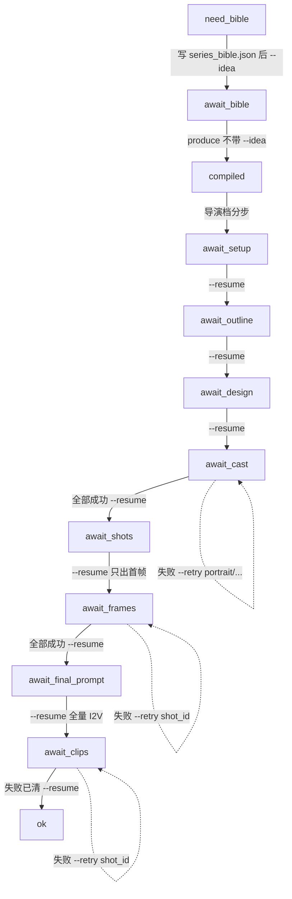

# 项目随行手册(PROGRESS_TRACKER)

> 本文件由 `montage init` / 多集物化时从仓库模板 `docs/PROJECT_TEMPLATE.md` 复制而来。
> **静态手册:项目内禁止改写或重生成**(模板升级走 git,不回灌已建项目)。
> 机器进度唯一事实源是 `artifacts/produce_progress.json`(status/next.argv);
> 本手册只回答"这一步怎么干、执法项是什么、哪里有坑"。两者冲突时以 progress.json 为准,
> 并在 `STATUS.md` 记一行"手册 X 节与 Skill 冲突"。

## 一、启动三读(每次接管项目/新会话必做)

1. 读本手册(行动指引:怎么干/执法项/坑);
2. 读 `artifacts/produce_progress.json`(机器事实:status/next.argv/steps);
3. 读 `STATUS.md`(前人手账:用户拍板过什么/改过哪些镜/踩过的坑)。

三读顺序固定。**下一步永远以 progress.json 的 `status`+`next.argv` 为准**;
`next.argv` 用当前 `python -m montage` 加从 `produce` 起的参数,不照抄 argv[0]。
停点必须等人点头,不见 `next` 就 exec。

## 二、流程图·机器停点层(与 produce_progress.json 的 status 一一对应)

**状态速查**:`need_bible`/`await_bible`/`compiled`/`await_setup`/`await_outline`/
`await_design`/`await_cast`/`await_shots`/`await_frames`/`await_final_prompt`/
`await_clips`/`await_retry`/`await_sample`/`await_episode`/`ok`/`fail`。
**可灵环差异(video_loop=kling)**:await_design → compile/await_shots → await_cast →
await_frames → await_final_prompt(定妆后移);以 progress.json 实际 status 为准。

## 三、流程图·Agent 协议动作层(无对应 status,虚线执行)

以下动作**不产生新 status**,发生在对应停点的人审前后:

- 编剧自审(每轮必做,不占轮次):validator+checklist+时长检查,留痕 review_log;
- 美术/动作指导审(点位一 await_shots 后、首帧前并行审源字段;点位二
  await_final_prompt 子 Agent 首审一次,之后主 Agent 换帽复审);
- 导演审/仲裁/振荡检测(依赖 review_log 数据,每轮 REVISE 必须 record);
- 六步失败归因(重抽/--retry 前必走;同字段连续 2 次 critical 且提示词未改=模型上限);
- 子 Agent 三维度盲审(design 角色轮后、await_design 人审前,仅一次)。

协议细则见仓库 `docs/ROLES.md`(多角色协作)、`docs/skills/meta/produce.md` 与
Skill `.cursor/skills/montage-produce/SKILL.md`。

## 四、分停点行动手册

| status | 读什么 | 改什么 | 下一步 | 专属执法/坑 |
|--------|--------|--------|--------|-------------|
| need_bible | format_card | 写 artifacts/series_bible.json(地点 sensory 交叉方位) | `produce --idea "同一句"` | Python 只抄不编造地标;没出现的格子不写空括号 |
| await_bible | REVIEW 摘要 | series_bible.json | `produce`(不带 --idea) | 尚未编译,不要当成分镜已定 |
| await_setup | REVIEW 摘要 | title/synopsis/target_duration/playbook/era | `--resume` | 时长定夺先于质量 findings |
| await_outline | 角色/地点/主题 | characters/locations/music_direction/gold_lines/theme | `--resume` | 金句 ≤6;对白 5 字/秒 |
| await_design | 外观/空镜/道具 | appearance/outfit/地点空镜/道具 | `--resume` | 全量 bible 门禁此后才跑;子 Agent 终审在人审前 |
| await_cast | 定妆/四视图/空镜/道具 | 重抽 `--retry portrait/<id>` 等 | 全部成功才 `--resume` | 重抽前走六步归因;失败不能进分镜 |
| await_shots | 各幕一行+总时长 | scene_plan.json(景别/运镜/台词) | `--resume` 只出首帧 | **改 series_bible 须先重编译再 --resume(V23 条款)**;点位一美术+动作并行审 |
| await_frames | n/n 成功;失败镜号 | `--retry <shot_id> --resume` | 全部成功才 `--resume` | 失败镜+VLM critical+hero 必读,其余每第 5 镜抽 1;重抽前六步归因 |
| await_final_prompt | 每镜最终提示词(只读) | 改提示词回 scene_plan/series_bible | `--resume` 才全量 I2V | 改 bible 须先重编译;子 Agent 首审不占额度,复审换帽 |
| await_clips | 成功/失败数 | `--retry <shot_id> --resume`;可灵可写 rework_mode | 失败已清才 `--resume` | 六步归因→模型上限四出口(简化/拆镜/换供应商/带警示),唯独不是继续改提示词烧钱 |
| await_prompt | (argv 为空) | 改圣经或 `--resume` 压缩兜底 | 见 Skill | 提示词超 3000 字停;不要立刻 exec |
| await_sample / await_retry / await_episode | 停点卡 | 样品/retry 对应操作 | `--resume` | 不是人审,但仍等人点头 |

**V23 重编译强制条款**:await_shots/await_frames/await_final_prompt/await_clips 状态下
改 `series_bible.json` 后,禁止直接 `--resume`——先读 progress.json 确认 status 为
`await_*`,再 `python -m montage run <dir> idea_developer --input inputs.json`
(inputs 仅 `{"operation":"compile"}`,bible 由工具从项目目录直读),最后 `--resume`。
改 scene_plan 直改不受此条款约束。

## 五、收尾手账纪律

每停点收尾(或用户终止/搁置)时,把**跨会话值得留的**写 `STATUS.md`(≤5 行/停点):
用户拍板、重编译改过哪些镜、踩过的坑。不写流水账——过程细节归
`artifacts/review_log.jsonl`(角色评审)与 `cost.jsonl`(成本审计)。
